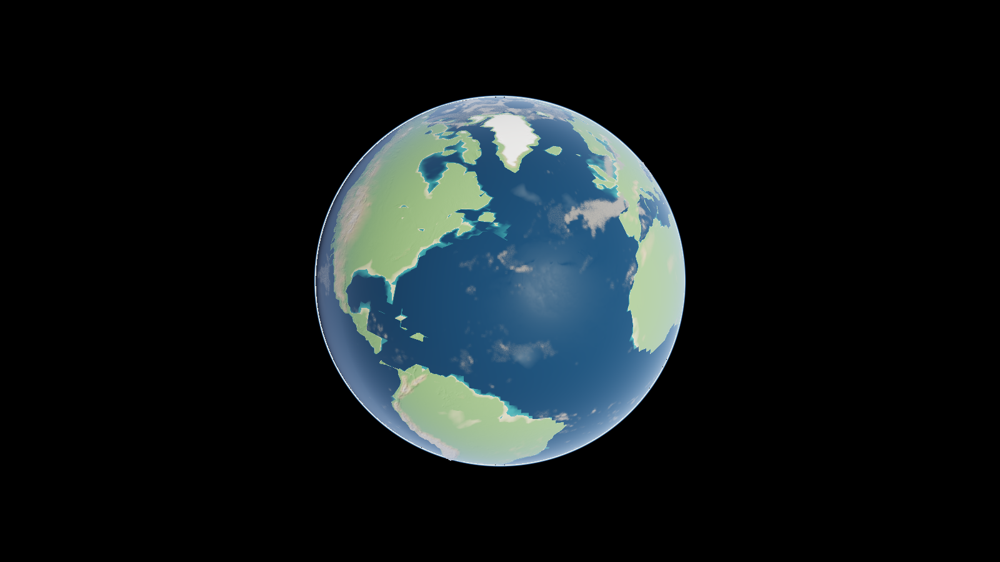
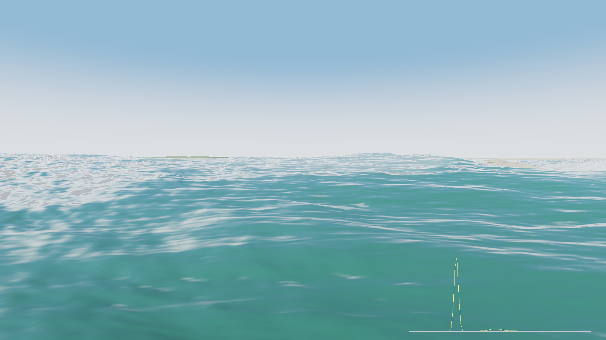
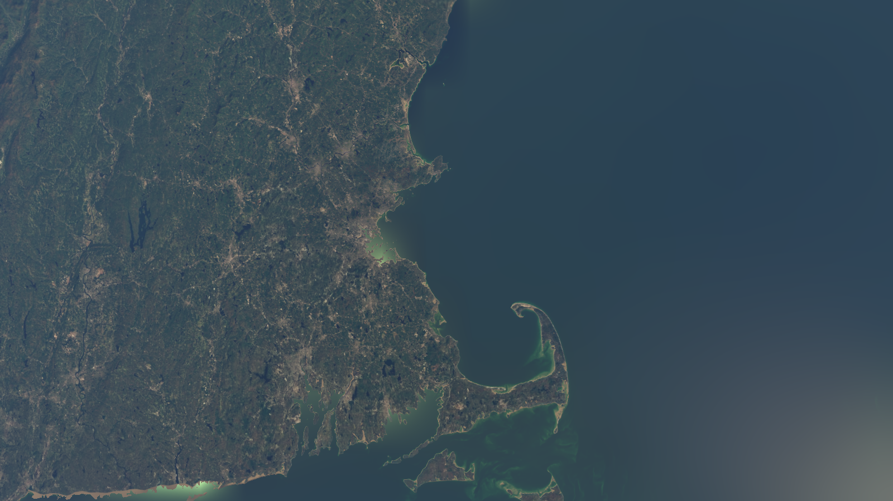

# GAGAME

A real-time, data-driven global ocean simulator built around geometric algebra: NOAA carries
the state, the GPU carries the phase, and everything stateful lives as sparse exceptions in
tiled-resource grade banks.


*The quad-sphere earth with the day's actual clouds — GFS isobaric cloud fraction ray-cast
through a sparse 3D volume bank where a NULL tile IS clear air.*

|  |  |
|---|---|
| *The Merrimack entrance at mid-ebb, helm height* | *New England from 220 km (ETOPO 15″ ring)* |

The plan lives in
[GAMEPLAN.md](GAMEPLAN.md); this README covers what exists today: **M0** (the tiled-resource
null-tile proof) and **M1** (live analytic tides for the lower Merrimack).

## Data is not included

This repository holds the code only. None of the data the engine draws (tides, waves,
currents, bathymetry, elevation, weather, aerial and satellite imagery) is checked in, apart from three small hand-surveyed GIS files
in `data/gis/`, and the
screenshots above were made from data fetched on the author's machine. Each dataset comes from
its provider through the harvesters in `harvester/` (the per-milestone sections below give the
commands), lands in `cache/` and `data/`, and stays under its provider's own terms, not this
repository's license. Most of it is US public-domain NOAA, USGS and NCEI data. Google Map Tiles
imagery needs your own API key and is bound by Google's terms. A fresh clone renders nothing
until those fetches have run.

## Build

```bat
build.bat
```

Finds the newest Visual Studio via vswhere, configures with CMake + Ninja, outputs
`build\bin\gagame.exe`. Shaders compile at runtime through DXC (`R` hot-reloads them), so the
`shaders/` directory must be reachable from the working directory — run from the repo root.

## M0 — the tile self-test

```bat
build\bin\gagame.exe --selftest
```

Creates reserved (tiled) 2D and 3D resources, maps a checkerboard of tiles, and verifies the
Tier-2 contract the whole gameplan leans on: NULL-mapped tiles read exactly 0.0 through both the
Load and Sample paths, writes into them are silently discarded, `CheckAccessFullyMapped` tells the
truth, and unmap/remap round-trips. Exit code 0 = pass. This machine: **tiled resources tier 4**.

Capture it in PIX: launch `gagame.exe --selftest` (working dir = repo root) under PIX and take a
GPU capture — every pass is marked (`tiletest.write2D`, `tiletest.read2D`, …) and the reserved
resource's tile mappings are inspectable in the resource view.

## M1 — the tides

One-time data fetch (network; everything is cached forever under `cache/`, ~90 small requests):

```bat
py -3 harvester\harvest_tides.py
```

This pulls, per station: CO-OPS metadata, the 37 harmonic constituents, and one year of NOAA's
official hourly predictions; then least-squares fits amplitude+phase at the exact constituent
frequencies, so the engine's stateless `mean + Σ A·cos(ωt + φ)` matches the official tables to
millimetres by construction. Output: `data/tides/stations.json` + official series sidecars.
After this the app is fully offline.

```bat
build\bin\gagame.exe
```

Shows the lower Merrimack as a ribbon (x = river km, height = tide, exaggerated) with a pylon per
station, and a plot of every station's curve across the scrub window — **solid = our analytic
model, dashed = NOAA's official predictions**; the two lying on top of each other is the M1 gate,
visible every frame. The title bar is the HUD (UTC clock, time scale, Newburyport height, fit RMS).

| Key | Action |
|---|---|
| `SPACE` | pause time |
| `UP` / `DOWN` | fast-forward / slow down ×10 per press (default 1× — REAL TIME: waves at their true speed) |
| `LEFT` / `RIGHT` | nudge −/+ 1 hour (`SHIFT`: 1 day) |
| `HOME` or `N` | back to now |
| `[` / `]` | halve / double the plot window (default 7 days) |
| `W A S D Q E` + right-drag | fly camera (`SHIFT` fast, `CTRL` slow) |
| left-drag | **grab the ground** — the point you grabbed stays under the cursor |
| `SHIFT` + left-drag | **tilt** — orbit about the horizontal line through the ground point at screen centre |
| `ALT` + left-drag | **rotate** — orbit about the vertical line through that point |
| wheel | zoom toward the point under the cursor (`CTRL`+wheel = fly-speed dial) |
| `R` | hot-reload shaders |
| `ESC` | quit |

## M2 — the sea

One-time wave fetch (~25 tiny requests via the NOMADS grib filter -- OPeNDAP is retired per
SCN 25-81 -- decoded by our own stdlib GRIB2 reader, plus NDBC buoy truth; cached forever):

```bat
py -3 harvester\harvest_waves.py
```

Then `TAB` in the viewer switches to the open-sea view: three FFT cascades synthesised from the
GFS-Wave partitions (wind sea + swell trains), riding the analytic tide, framed like vqview's
north-jetty-tip shot (az 246). The bottom-right panel plots the model spectral density S(f)
(solid) against buoy 44013's measured spectrum (dashed); the title bar compares model Hs against
the buoy's observation. Re-run the harvester whenever you want a fresh forecast cycle.

Sea-mode extras:

```bat
build\bin\gagame.exe --sea --storm 4.5,11,70
```

`--storm hs,tp,fromdeg` overrides the forecast with a sandbox sea state (swell + implied wind
sea, whitecaps and all). `--sea-verify` reads the displacement textures back after the run and
prints the RENDERED significant height against the model target (agreement ~1%) plus per-cascade
Jacobian stats. `--foam x` scales whitecap intensity.

## M3 — currents, and the first live GA

One-time fetch (CO-OPS tidal-current predictions for the entrance stations, buoy 44029's ADCP,
and the GoMOFS surface-current field via THREDDS OPeNDAP index subsets):

```bat
py -3 harvester\harvest_currents.py
```

Two things light up:

- **The sea view feels the tide.** The ACT0816 prediction clock drives an analytic ebb/flood jet
  through the entrance; each FFT cascade is amplified against its own band phase speed
  (`ω' = ω + k·U` linear wave-action theory, saturating at the blocking limit), so the ebb
  barely touches an 11-second swell but BLOCKS the chop band into a breaking, churned bar --
  compare `--start` at max ebb vs slack. The title bar shows the live current.
- **TAB again: the gulf view.** The GoMOFS field feeds `VelGrad.hlsl` -- the first call sites
  vqview's dormant GA toolkit has ever had: one pass packs divergence (grade 0), the current
  (grade 1) and vorticity (grade 2) into a single Multivector2 texel, with Okubo-Weiss beside.
  The map tints rotation-dominated water by the bivector's sign: violet cyclonic, amber
  anticyclonic. Validation: the field at buoy 44029 vs its ADCP, in the title bar.
  (Stored fields are scaled -- vorticity in 1e-5 1/s, OW in 1e-10 1/s^2 -- because raw ocean
  values sit below fp16's subnormal floor and silently flush to zero.)

## M4 — the tiled multivector atlas

`TileAtlas2D` (src/core/TileAtlas.cpp) is the real thing the M0 self-test rehearsed: a reserved
resource over a large virtual domain with CPU residency (heap-pool backed, batched
`UpdateTileMappings`), plus the Cl(2) GRADE-SIGNATURE machinery -- one bit per grade per tile,
with the geometric product's output signature derived from the algebra so sparsity propagates
through products without reading data (`--selftest` proves the closure sound and tight for all
49 signature pairs, and exercises a live map/clear/stamp/unmap cycle).

Its first tenant is the engine's FIRST stateful field: the **churn memory** -- where the ebb
blocks the chop band, breaking deposits aerated water whose whiteness lingers (tau ~90 s) and
fades. It lives in a 16 x 16 km / 2 m virtual domain (128 MB) of which only the tiles along the
breaking bar are ever resident (a few MB); everywhere else the sea shader's one sample reads a
hardware-guaranteed zero. Freshly mapped tiles are cleared before use (their pool memory is
undefined), simulation dispatches walk the resident list only (null writes would vanish), and a
scrub jump resets the field -- memory of a time that no longer exists.

`V` (or `--viz`) overlays the residency: green tiles = state lives here, red grid = NULL.
The sea title bar reports `churn N/2048 t  X/128 MB`.

## M5 — the estuary, rendered

One-time terrain fetch (one ~167 MB CUDEM tile from the NODD mirror, decoded by the stdlib
GeoTIFF reader -- deflate + floating-point predictor -- windowed to the mouth):

```bat
py -3 harvester\harvest_bathy.py
```

The sea view then becomes the actual place: the CUDEM topobathy drawn at true scale
(TerrainLayer; jetties, bar, dunes, marsh -- materials keyed to the LIVE water level), the sea
georeferenced onto it (world origin = the ACT0816 entrance station, as always), waves
depth-attenuated toward shore, surf breaking where the water thins to the waves' height, and
shallow-water colour from two-way extinction toward the sunlit bed. The default camera STANDS ON
THE NORTH JETTY TIP (world 522, 72 -- located in the data), looking az 246 into the inlet:
vqview's signature shot, now literal. Datum: terrain is NAVD88, tides are MLLW; `--datum` tunes
the join (default -1.30 m) until the CO-OPS NAVD datum fetch lands in M5b.

Try `--start` at low vs high water for the flats breathing, or a storm ebb:

```bat
build\bin\gagame.exe --sea --storm 3,11,95 --start 2026-08-28T18:55:00
```

`py -3 harvester\harvest_river.py` fetches Merrimack discharge (USGS legacy service -- currently
in its decommission brownouts; the keyed api.waterdata.usgs.gov migration is M5b, where the
discharge becomes the upstream forcing of the shallow-water solver).

## M5b — tessellation and the standing waves

The sea is now HARDWARE-TESSELLATED (vqview's chain, ported): 64x64 four-point patches from
SV_VertexID, per-edge factors from projected screen length (`--edge-px`, default 12) computed
from each edge's two shared corners so neighbours agree bit-for-bit -- sub-metre triangles at
the helm, coarse at the horizon. Displacement lives in the domain shader.

The wave-current physics went depth-aware in the same pass: each band's phase speed comes from
finite-depth dispersion at the LOCAL CUDEM depth -- an 11 s swell drops from ~17 m/s to ~6 over
the 4 m bar, so the ebb drives the SWELL toward blocking exactly where the entrance famously
stands up -- plus Green's-law shoaling and a depth-limited breaking clamp (|eta| <= 0.55 h)
whose clipped excess becomes foam. `--height-scale` (default 1.15, vqview's shipped look)
exaggerates vertically.

PIX: `pixtool launch ... take-capture save-capture` works scripted (see helm_frame.wpix in the
repo root for a captured helm frame); markers use the legacy encoding, which PIX flags as
deprecated -- the WinPixEventRuntime upgrade is on the list.

Headless verification (no window, writes a PNG):

```bat
build\bin\gagame.exe --dump out.png --start 2026-08-28T12:00:00 --frames 1
```

## M5c — the estuary flows

The water is no longer a picture of a tide: a **sparse shallow-water solver** (SweSolver +
Swe.hlsl) runs over the CUDEM grid, its state held in two `TileAtlas2D` grade banks — eta
(R32F) and signed staggered face-fluxes (RG32F) — resident only over tiles that can ever be
wet. The eta bank stores the DEVIATION from the analytic tide plane, so a NULL tile literally
means "the stateless model is exactly right here": the offshore sponge (ramped, past the bar)
relaxes deviations to zero — that IS the tidal forcing — and the west edge is a Dirichlet
strip riding the **station-interpolated river tide** (Newburyport↔Salisbury Point, from the M1
fits), so the tidal prism upstream of the CUDEM window arrives as data instead of being lost
to truncation. The scheme is signed-staggered with implicit quadratic bottom drag (Cd 0.0025)
and donor-cell positivity; the classic game "pipe model" was the first cut and its rectified
`max(0,·)` outflows ratcheted unboundedly under real ocean friction — the field pictures that
diagnosed this live on in `--swe-uv` (current/eta/flux false-colour dumps).

Coupling out: the sea's mean surface adds the solved deviation per-vertex, and the wave-current
physics samples the solved field INSTEAD of the analytic Gaussian jet wherever it is valid —
the ebb jet now has the real channel's shape. Magnitude honesty: the window holds roughly a
third of the real prism, so sampled currents carry a ×3.2 gain calibrated once against the
ACT0816 predictions (`--swe-gain`; retires when the M6 domain widens).

Validation (`--swe-cycle 14` → `data/swe_cycle.csv`, probes at the sponge, the ACT0816 throat,
a 6-point jetty-gap transect, Joppa Flats, and the river):

- gap current vs the CO-OPS ACT0816 prediction: **r = 0.93** (28 min phase shift)
- **flood dominance emerges**: ours 1.30, ACT 1.61 (this entrance really is flood-dominant)
- ebb→flood slack lands on the predicted hour; basin lag 8 min, attenuation 0.99 (a
  well-connected bay — the big lags are upriver, and now enter through the west boundary)
- ocean sponge residual ≤ 3 cm: the join to the stateless ocean is clean

Also in this pass: **swell shadowing** — a CPU line-of-sight march toward the peak-wave source
builds a graded exposure mask (rebuilt when the direction or water level moves; an awash bar
breaks-and-transmits ~0.5, a jetty crest throws a 0.12 deep shadow; the chop band only feels
35% of it) so storm seas go calm in the lee of the north jetty while the bar outside stands up
— and the FFT foam now scales with each band's local amplitude so the lee is not white. The
MLLW→NAVD88 join is resolved from **CO-OPS station datums** (harvest_tides now fetches them;
Boston calibrates NAVD = local MSL + 0.09 m, giving −1.396 m at Newburyport vs the old −1.30
guess), and USGS discharge is back (Lowell live at 36 m³/s; the station tides carry the stage
into the boundary, so no separate injection is needed).

Flags: `--swe-off`, `--swe-spinup H` (default 0.25 h of history before the first frame),
`--swe-cycle H` (headless validation → CSV), `--swe-uv f.png` (field pictures), `--swe-gain X`,
`--river Q`. PIX: `swe_frame.wpix` in the repo root captures the full frame — 16 flux/height
substep pairs + derive under the `swe` marker, then the FFT, churn, terrain and sea passes.

## M6 — the planet (first slice)

One-time fetch (~450 MB of ETOPO 2022 from NCEI, cached forever, box-decimated by the stdlib
GeoTIFF reader to an 8192×4096 equirect grid at ~5 km/texel; plus ~3 MB of the LIVE global
GFS-Wave Hs + 10 m wind — the raw global files are JPEG2000-packed GRIB2, which the NOMADS
filter obligingly re-encodes when the whole world is requested *as a subregion*):

```bat
py -3 harvester\harvest_globe.py
```

`TAB` (or `--globe`) then adds the fourth view: **the earth**, drawn as a quad-sphere CDLOD —
the CPU walks a quadtree per cube face in doubles (frustum + horizon culled) and every emitted
node draws one shared 32×32 grid whose vertices morph between LOD rings in the vertex shader,
so the rings cross-fade with no cracks and no stitching. The ocean is shaded from the live
wave fields: **Cox-Munk slope variance from the wind drives the sun-glint lobe** (the far-field
BRDF — waves too small to resolve become roughness) and significant height whitens the storm
belts, so today's North Atlantic gale is visibly rougher than the doldrums. Relief
exaggeration scales with altitude (real below 250 km); an orange beacon marks the Merrimack.
The PGA camera works at planet scale: plain drag **grabs the globe** (one motor about the
planet-centre line), SHIFT tilts and ALT rotates about the grabbed surface point, wheel zooms
toward the cursor. Measured: ~0.25 ms/frame at 1600×900 — the 60 fps gate holds with two
orders of magnitude to spare. `--globe-cam lat,lon,alt_km` frames headless shots.

Deliberate v1 cuts: GEBCO 15″ detail + tangent-frame precision below ~2 km altitude, relief
mips, and the atmosphere shell past the limb. PIX: `globe_frame.wpix`.

## M6b — the seam, and the camera on rails

The two worlds are now JOINED: the estuary's flat frame is the local tangent plane at the
ACT0816 origin, and crossing ~3 km altitude within ~12 km of home hands the camera off —
position and aim mapped exactly between frames, with hysteresis (climb past 4 km to return to
orbit). Fly down from space and you land in the CUDEM estuary; fly up and the planet takes
you back. The aerial haze became height-integrated in the same pass (exponential atmosphere,
H = 1.3 km), so the view down from altitude no longer drowns in sea-level fog.

The debug **camera rails** are pure GA: each keyframe pose is a motor, and segments play back
through the screw interpolation `M₀·exp(u·log(M̃₀M₁))` — `Motor::Log/Exp/Slerp` in
[Pga.h](src/core/Pga.h), selftest-pinned — so each leg is one smooth helical motion with
position and aim carried together (any interpolated roll is dropped on extraction; the
horizon stays level). The flight: orbit → 2.6 km over the estuary in 5 s (through a 500 km
mid-key), hold 5 s, descend to the north-jetty helm in 5 s, hold 10 s while the real-time sea
runs. It crosses the globe→estuary seam mid-descent — the M6 gate's "one unbroken shot":

```bat
build\bin\gagame.exe --rail rail_frames --storm 2.5,10,95 --start 2026-08-28T18:30:00
```

writes 750 PNG frames (25 s at 30 fps, deterministic real-time sim), ready for
`ffmpeg -framerate 30 -i rail_frames\rail_%%04d.png -c:v libx264 -pix_fmt yuv420p rail.mp4`.

Time now runs at 1× by default — waves at their true speed (the old 900× default made the
sea boil); `UP`/`DOWN` fast-forward and the tide chart still scrubs with `LEFT`/`RIGHT`.

## M6c — the sky is a volume bank

`harvest_globe.py` now also pulls **GFS isobaric cloud fraction** (10 pressure levels, 0.5°,
~2.5 MB — the raw files are JPEG2000-packed, so the whole world is requested *as a subregion*
and the filter re-encodes; grib2.py learned template 4.8 for the time-averaged fields). The
engine builds it into the first **TileAtlas3D** tenant: a 1024×512×64 R16F density volume over
lon × lat × 0–12.8 km whose tiles are resident only where weather exists — **a NULL volume
tile IS clear air**, the same hardware zero that means "flat tide plane" in the eta bank. A
one-shot list-driven kernel (CloudVol.hlsl) spreads each level as a Gaussian slab (a 55 km GFS
cell is not a razor sheet) and carves it softly with value noise; the globe's pixel shader then
ray-casts 14 jittered steps through the bank — clouds light by sun with a one-sample
self-shadow, and cast moving shadows onto the sea beneath. The atmosphere gained its **limb
shell**: a fullscreen single-scatter pass puts the blue rim past the edge of the disc and the
sun in space. Relief got a real mip chain (no more far-zoom coastline shimmer) and the
dateline seam is gone (wrap sampler, poles clamped). Whole globe frame with clouds: ~0.3 ms.

The RTX question, measured: at 14 steps the sparse march costs ~0.04 ms — ray *casting* is
already what this is, and the page table skips clear air nearly free. The DXR win (inline
`RayQuery` against a BLAS built from the resident-tile list — the residency manager doubling
as the acceleration structure) is slated for the near-field estuary sky, where step counts
grow. See GAMEPLAN §12.

## M6d — the wide window, the 15″ ring, and sparsity's first law

Re-run `harvest_bathy.py` and `harvest_globe.py`: the estuary window now spans the river to
Rocks Village (~km 15) **and Plum Island Sound** (two CUDEM tiles stitched, 1863×1174 at
~13.7 m), the globe gains a **New England 15-arc-second relief ring** (~460 m — real Cape Cod,
the Whites' ridges, Stellwagen's shape — blended inside its window below the mip ring where
the global texture runs out), and the live **10 m wind vector** feeds a sparse Mv2 bank: one
planetary velocity-gradient pass (GlobeWind.hlsl — the M3 decomposition on the sphere, metric
and all) writes (div, u, v, **curl**), and `V` in globe view tints the day's cyclones violet.

The wide window taught three lessons worth their line here. **Station heights live in their
own MLLW datums** — differencing Merrimacport against the entrance smuggled a constant 19 cm
seaward slope into the west boundary (a permanent artificial ebb) until the boundary switched
to tidal-parts-only. **A pinned boundary must not offer a bypass**: pinning the sound's whole
marsh edge let the tide short-circuit into the basin and halved the throat current; only the
deep channel is pinned now. And **13.7 m box-averaged channels under-convey**: the solved
km-6→15 reach damps and delays the upriver prism (cycle validation holds r = 0.91 vs ACT0816
with a −36 min shift; `--swe-gain` recalibrated to 5.0; subgrid channel conveyance is the
tracked fix). Sparsity's first law, measured twice: a 64 KB tile's FOOTPRINT must be smaller
than the features — the 3-D cloud bank's 32³ tiles carve real clear-air nulls, while the 2-D
wind bank's 64°×32° tiles at 0.5° catch some storm everywhere (36/36 resident; fine-grained
wind sparsity wants HRRR-class grids).

## The camera is a motor

The Google-Earth gestures above are the engine's first CPU-side geometric algebra:
`core/Pga.h` implements **motors in Cl(3,0,1)** (plane-based GA — the even subalgebra, stored in
its dual-quaternion coordinates), and each tilt or rotate is ONE motor: the exponential of the
world **line** through the grabbed ground point — vertical for rotate, the camera's horizontal
right-axis for tilt — applied as a sandwich to the camera's position and aim together. No
translate-rotate-translate bookkeeping, no drift between position and aim, and `--selftest` now
pins the conventions numerically (offset-axis rotation, T·R·T⁻¹ equivalence, composition,
rigidity) before any GPU work runs. The pivot itself comes from a ray-march against the CUDEM
bed + live water level, so you can grab the jetty, the bar, or the sea. M7's vessels will ride
the same motors.

## M6e — two planets, one residency manager

`src/core/Residency.h` unifies every tiled tenant, descended from the classic D3D11
TiledResources sample's ResidencyManager (studied from a rescued copy of the extinct original)
and split along the project's own fault line: **fields** (churn, SWE, wind, clouds -- NULL tile
MEANS zero, sampled unconditionally, residency decided by physics) versus **textures** (NULL
means absence: an R8 residency-map cube clamps sampling to the finest RESIDENT mip, so misses
blur instead of breaking, under the classic's coarse-before-fine invariant). Tiles stream
through worker threads into `CopyTiles(LINEAR_BUFFER_TO_SWIZZLED)`, mapped in budgeted batches,
LRU-evicted only past the frame-overlap window, prefetched along the camera's PGA screw
(`PredictNextPose = M Exp(dt Log(~M0 M1))`), with grade-signature demand derivation
(`Cl2ProductSignature`) deciding where derived fields can even be non-zero.

Two providers feed it: **Mars** — the sample's own 16k-per-face BC1/BC5 cube pyramids (format
decoded from its TileLoader: headerless 64KB tiles, face-major mip-major), placed in
`data/earth/*.bin`; and **Earth** — Google Map Tiles 2D imagery, cache-forever
(`cache/google/`), session-token reuse across runs, >=80 ms between fetches and a hard per-run
budget (`--tile-budget`, default 1000), reprojected Web-Mercator -> cube faces at fetch time.
Set the key once with `setx GAGAME_GOOGLE_MAPS_KEY "..."` (never committed; read from env or
HKCU). Imagery (c) Google.

```bat
build\bin\gagame.exe --planet mars
build\bin\gagame.exe --globe
```

## Layout

The engine after M12 — `docs/ARCHITECTURE.md` is the map, this is the index.

- `src/main.cpp` — the shell: resolve the scene once, run a tool or assemble and loop.
- `src/app` — `Options` (the flags, and the shim that writes them into a scene), `Scene` (the
  resolved scene, typed), `Assembly` (the engine built in its lifetime order), `FrameLoop` (the
  session and the frame's fixed phase order), `Tools/` (the one-shot modes, by name), `FramePipe`.
- `src/core` — the algebra and the contracts with no GPU in them: PGA motors (`Pga.h`), the conformal
  model (`Cga.h`), the frame calculus (`Space.h` placements and the fold, `Lattice.h`), the Droste
  closed forms, units, the GA AST, `Registry.h`, the scene-config readers, the self-tests.
- `src/hal` — Direct3D 12 and nothing else touches it: the device, the command context, pipeline
  builders, typed views and root layouts, tiled residency and `Tenant` (the sparse default),
  DirectStorage, shaders, the profiler, PIX, the retire queue. `tools/hal_lint.py` holds the line.
- `src/compose` — the tile trees and the compositor; `SurfaceFrame`, the one declared surface.
- `src/render` — the renderer (a list of views) and the camera.
- `src/scene` — the layers (sky, tide, sea, terrain, gulf, water bank, globe, GIS, vessels, markers)
  and the scene graph: `Props`/`Schema`, `SceneBuilder` (the fold), `Node`, `Component`, `View`,
  `WaterComponent`, `Entity`, `Portal`, `Rail`, `Effect` (`effects/`), `SceneReload`, `SchemaDoc`.
- `src/sim` — the analytic tide, sea state, currents, bathymetry, the shallow-water solver, the wave
  field, the weather manager, the globe data, vessels and their factory.
- `scenes/` — `merrimack.json` (the default scene), `chart.json`, `mars.json`, `views/`, `rails/`,
  `recipes/` (every recorded run as a file).
- `shaders/` — HLSL, compiled at run time (editing needs no rebuild).
- `docs/` — `ARCHITECTURE.md`, `ALGEBRA.md` (the math and the priors ledger), `LAUNCH.md`, the GA AST
  (`GA_AST.md`, `ga_ast.json`) and the UI contracts (`scene_schema.json`, `registries.json`); the
  Scriptorium serves `ALGEBRA.md` as `math` topics and `LAUNCH.md` as `note` sections.
- `tools/` — the gate harness (`gate_stills.sh`, `gate_compare.sh`, `stills.sh`, `imgdiff.py`,
  `raildiff.py`), `hal_lint.py`, `algebra_lint.py`, the Scriptorium MCP server.
- `harvester/` — the polite NOAA fetch + fit tooling (stdlib Python).
- `data/` — generated engine data; `cache/` — raw provider responses (both regenerable).

## License

[0BSD](LICENSE) — use, copy, modify and distribute for any purpose, with or without fee, with
no attribution required.

A note from the author: while not required, I would welcome it if you used this license on
your forks too.

The one exception is third-party data checked in alongside the code:
`data/gis/osm_structures.json` is OpenStreetMap data and stays under the
[ODbL](https://opendatacommons.org/licenses/odbl/) (© OpenStreetMap contributors). Data the
harvester fetches at run time carries its source's own terms, which the harvester records.
