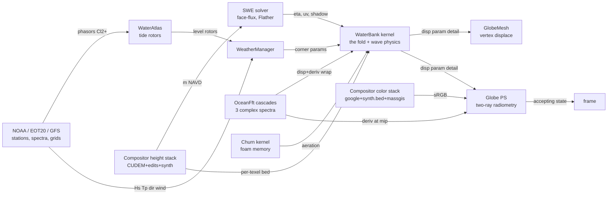

# THE ALGEBRA — GAGAME's mathematical machinery, in one place

This is the reference whitepaper for every algebra the engine runs: the geometric algebra
proper, the wave physics, the radiometry, the frame calculus, and the compositor's
bookkeeping. It exists so that a fresh session (or an outside expert) can load the whole
mathematical mindset from one document instead of re-deriving it from scattered shader
comments — and so that **divergences between textbook priors and what this project
actually measured** are recorded where they cannot be un-learned (see `priors — The
priors ledger`, which is the section to read FIRST when something feels off).

Conventions used throughout: world frame is the flat one-world map (+x east, +z north,
metres, anchored at ACT0816; see `frames`); heights are metres NAVD88; angles radians
unless noted. Each section ends with Code / Gates / AST anchors. The scriptorium serves
these sections via the `math` tool (`math()` lists topics, `math(topic)` prints one).
Machine contract: sections are `## topic-id — Title`; do not rename ids casually — the
scriptorium ingests them by id.

The state diagram (nodes are engines, edges carry the products; the full frame table with
flips and ranges is generated every run into `docs/GA_AST.md`, the machine-readable graph
into `docs/ga_ast.json` — the future node-editor's file format — and the drawn catalog
into `docs/diagrams/ga_full.svg` + per-domain pages via `tools/astdiagram.py`):

## pga — Motors: Cl(3,0,1) and the camera's rigid algebra

The projective geometric algebra Cl(3,0,1) (degenerate metric, e0² = 0) carries every
rigid transform as a **motor** M in the even subalgebra: rotor ⊗ translator, acting by
the sandwich

    X′ = M X M̃

on points/lines/planes uniformly. The engine uses motors for camera pose composition and
the rails: a pose is a motor, a rail is a curve of motors, and interpolation is the
**screw slerp** — log each motor to its bivector screw (axis + pitch), lerp in the log,
exp back:

    M(t) = M₀ · exp( t · log(M₀⁻¹ M₁) )

which yields constant-twist motion (rotation and translation advance together along the
invariant screw axis — no separate lerp of position/quaternion, no gimbal artifacts, and
composition M₂M₁ is associative rigid chaining by construction). Orbit keys and helm
poses (`poseMotor`, `orbKey`, `railPose`) are all motors; a rail is `vector<(t, Motor)>`.

Invariants pinned by the gate: sandwich preserves distances (rigidity), offset-axis
rotation lands where the matrix path lands, log∘exp is identity on screws, slerp
endpoints reproduce the keys.

Code: `src/core/Pga.h` (the multivector layout + products), `main.cpp` railPose.
Gates: `pga` (motor self-test). AST: camera edges are implicit (world frame both sides).

## cl3 — Vector algebra of Cl(3): reflection and refraction as versors

The pixel shader's optics are grade-1 sandwiches in ordinary Cl(3):

**Reflection** of a direction d about unit normal n IS the versor sandwich

    r = −n d n = d − 2(d·n)n

(the right side is the expanded form the shader runs; the left is what it *is*). Used for
the water's reflected sky ray.

**Refraction** (Snell) is a **rotor in the incidence plane**: with B̂ = (d∧n)/|d∧n| the
unit bivector of the incidence plane, θᵢ the incidence angle, θₜ = asin(sin θᵢ/η′) the
transmitted angle (η′ = n₂/n₁ = 1.34 for air→water), the transmitted direction is

    t = R d R̃,   R = exp(−(θₜ−θᵢ)/2 · B̂)

whose closed form (what the shader runs, with η = 1/1.34, cᵢ = −d·n):

    t = η d + (η cᵢ − √(1 − η²(1−cᵢ²))) n         if η²(1−cᵢ²) < 1
    t = d + 2cᵢ n                                  (total internal reflection → sandwich)

The gate constructs R explicitly from the bivector and verifies the closed form equals
the sandwich for random incidence, including the TIR boundary.

Code: `shaders/Globe.hlsl` (M7c "THE TWO RAYS" block). Gates: `gatest` (sandwich +
refraction rotor). AST: `world.flat` frames both sides (no transform edges involved).

## cl2 — Spinors of Cl(2)+: tidal phasors and every 2-component fiber

Cl(2)⁺ ≅ ℂ. A tidal constituent's state at a point is a **phasor** P = (re, im) — a
spinor whose magnitude is amplitude and argument is phase. The laws:

**Synthesis** (CPU rotors, per frame): water level at time t from constituents c with
angular speeds ω_c (deg/hr: M2 28.9841042, S2 30.0, N2 28.4397295, K1 15.0410686,
O1 13.9430356):

    h(x, t) = msl(x) + Σ_c  Re[ P_c(x) · e^{iω_c (t − T0)} ]

**Interpolation law**: phasor fields blend **componentwise on (re, im)** — bilinear on
amplitude/phase is WRONG across a phase gradient (it collapses amplitude; the chord of a
rotating unit vector is shorter than the arc, and worse, phase wraps). Componentwise
re/im interpolation is the geometrically sound spinor blend. This law governs the
FieldChannel realizations (RG16F tiles), station IDW (p=2 on phasors), and EOT20
ingestion.

**Epoch alignment**: joining two phasor sources with unknown relative epoch, the least-
squares rotation is

    δ = arg Σ_s  P_s · conj(Q_s)

(rotate one set by e^{iδ}; used to align EOT20 against the station fits).

The same Cl(2)+ fiber carries currents (u,v) and any 2-component field in the
compositor's `FieldSource` contract.

Code: `src/compose/WaterAtlas.*` (sources, ladder, self-test), `Compositor::
SampleFieldStack`. Gates: `watertest` (fit reproduction 0.0 mm, tile-vs-stack identity,
seam 2.1 mm). AST: `compose.stack` field edges (latlon → mercator, flip at paint).

## fft — The cascade sea: three complex spectra

The ambient sea is three independent FFT cascades (patch sizes L = 756 / 186 / 47 m at
256², texels 2.95 / 0.73 / 0.18 m), each a directional spectrum realized to a
displacement texture (dx, dy, dz) + a derivative texture (∂x, ∂z slopes + Jacobian). Band
k-space is partitioned at cuts kCut = 2π/756, 2π/60, 2π/12, 0.9π·256/47 with each band's
**representative wavenumber** the geometric mean of its cuts — the single k that stands
for the band in the fold and the wave physics:

    k_c = √(kCut_c · kCut_{c+1})     (λ_c = 2π/k_c ≈ 213, 26.9, 2.2 m)

The Jacobian's negative excursions mark plunging crests → the foam channel (s.w).
Sampling is world-position wrap: uv = frac(xz / L_c) — same convention in the bank
kernel, Sea.hlsl, and the Globe PS (AST: `patch.wrap +v=N`, no flip anywhere).

Code: `src/scene/OceanFft.*`, `SeaLayer` cascade plumbing, `WaterBank.hlsl` fold loop.
Gates: seaVerify (rendered Hs vs model Hs ±10%). AST: `ocean.fft → water.bank/globe.ps`.

## fold — Grade shedding: the multiscale energy ledger

THE law that makes one water work at every altitude. A band with wavelength λ sampled by
texels of size T carries **geometry** only while the texels resolve its phase; past
Nyquist it must not alias — its energy **sheds to statistics** (slope variance σ²,
consumed by the glint BRDF). The fold weight:

    w(λ, T) = 1 − smoothstep(0.12λ, 0.5λ, T)

Displacement adds s·w·A; the shed complement adds to variance:

    σ² += (1−w) · A² · mss_c,   mss = (0.0004, 0.0018, 0.0060) per band

where A is the band's local amplitude gain (`physics` below). Because both sides carry
A², total energy is conserved across any texel size — coarse rings hold as statistics
exactly what fine rings hold as geometry, so ring handovers cannot pop energy.

**The three-tier telescope** (per pixel, per band): wRing = w(λ, ringTexel) is what the
bank's geometry carries; wPix = w(λ, pixelFootprint) is what this pixel could resolve;
the difference

    wDet = saturate(wPix − wRing)

is recovered in the PS from the full-resolution derivative textures (normal detail +
sparkle), and σ² hands back the same share. At altitude wPix ≤ wRing and every term
vanishes; at the helm wDet fills the gap. No altitude branches — the tiers telescope by
construction.

**The folding law** (learned twice, M6t and M7s): *never threshold or gate a
box-averaged field — average the thresholded answers.* Folding commutes with linear
operations only; any nonlinearity (a classification cutoff, a breaking threshold) must
be applied at fine scale and its **answers** averaged (coverage), or coarse LODs invent
qualitatively wrong content (the smooth-brown-earth bug: a marsh's box-averaged bed
slid under a classifier cutoff that no fine sample crossed).

Code: `shaders/WaterBank.hlsl` (kernel fold), `Globe.hlsl` M7a detail loop, `Sources.cpp`
BedSynthSource (coverage fold). Gates: `gatest` (fold telescope identities). AST:
`ocean.fft` edges; ranges column carries the amplitude budgets.

## physics — Finite-depth wave physics: dispersion, shoaling, blocking, breaking

Per band (representative wavenumber k, local depth h, collinear current U∥):

**Dispersion / phase speed**:  c(k,h) = √( g/k · tanh(kh) )

**Group speed**:  c_g = ½ c (1 + 2kh / sinh 2kh)

**Shoaling** (Green's law, energy-flux conservation as c_g drops):

    S = √( c_g^deep / c_g ),  clamped to [0.75, 1.7]

**Wave–current amplification** (wave action over an opposing/following current;
r = U∥/c₀):

    c′/c₀ = ½ (1 + √(1 + 4r))          (relative phase speed)
    A_wc  = 1/√( (c′/c₀)² (2c′/c₀ − 1) ),  clamped [0.55, 2.0]
    blocking as r → −¼:  A_wc saturates to 1.45 and the blocked fraction
    b = smoothstep(−0.16, −0.245, r) drives breaking foam instead

(the −¼ blocking point is exact linear theory; the 1.45 saturation and the smoothstep
band are engineering closures — real waves break rather than blow up).

**Local amplitude gain** per band: A = hsScale · exposure · S · A_wc, where hsScale is
the GFS-Wave Hs over the cascade reference, and **exposure** is the swell shadow: a CPU
line-of-sight march toward the peak-wave source over the live bed (≈0.12 in geometric
shadow, floor 0.18 in the bank for local chop).

**Depth-limited breaking** (bank kernel, after displacement): |η| ≤ 0.55·h, excess
converted to foam; matches the classical H ≤ 0.78 h with H = 2η.

**The 7-foot-standing-wave term** (why the entrance stands up): an 11 s swell in 4 m of
water has c ≈ 6 m/s, so a 1 m/s ebb reaches r ≈ −0.17 — a third of the way to blocking —
exactly over the shallow bar. Deep water shrugs the same current off (c ≈ 17 m/s).

Independent verification: `proofs/inlet_storm.py` runs these same closed forms on the
engine's exported fields (numpy, no engine code); the match report holds the kernel to it
(shape-normalized corr ≥ 0.9 per ring, mean |log ratio| ≤ ~4%).

Code: `shaders/Jet.hlsli` (pure functions), `WaterBank.hlsl` (application),
`SeaLayer::BuildShadowMask`. Gates: `gatest` endpoint pins; the M7p match report.
AST: `swe.solver → water.bank` (shadow), `compose.stack → water.bank` (corners).

## swe — The shallow-water solver: face fluxes, Flather, the prism

Depth-integrated shallow water on an equiangular CUDEM grid (per-axis metric: dx = 10.08,
dy = 13.65 m — one latitude's cosine, frozen per axis, NOT square):

    ∂η/∂t = −∇·q + sponge,      q = h·u (face fluxes)
    ∂q/∂t = −g h ∇η − c_f |u| u / h + advection(off)

**Flather radiation west boundary** (the river feed): u = u_ext ± √(g/h)(η − η_ext),
with the exterior prism current u_ext = Q/(A_prism) from the upriver tidal prism
(kUpriverAreaM2 = 3.9e6 m²) — the boundary radiates what the interior cannot hold and
feeds what the exterior tide demands.

**The prism-debt term**: dη −= g_tideRate · dt inside the domain accounts for storage
the truncated upriver estuary would have absorbed (tideRate finite-differenced from the
atlas rotors); without it the truncated domain floods high.

Sponge on the seaward edge (x ramp), jetty walls as reflective masks, eta/uv atlases
row-0-north (every consumer flips; see AST).

Validation: throat current vs ACT predictions r = 0.959, lag +4 min, gain 1.0.

Code: `shaders/Swe.hlsl`, `src/sim/SweSolver.*`. Gates: solver soak in watertest-adjacent
harness; the flood-rail visual. AST: `swe.solver → water.bank/sea.ps` (FLIP edges).

## radiometry — The two-ray water and the lit planet

A water pixel is a Fresnel split between two rays, both answered by data the engine
already owns (no BLAS — the scene descriptions are our own quadtrees):

    L = F(θ)·L_sky(r̂) + (1−F)·[ T_w ⊙ ρ_bed·E_bed + (1 − T_w) ⊙ C_scatter ] + L_glint

- r̂ = −n d n (reflected ray, `cl3`), L_sky the analytic sky radiance (discless sun +
  gradient), F = Schlick 0.02 + 0.98(1−cosθ)⁵ on the true wave normal.
- The refracted ray (`cl3` rotor) marches into the water and lands on the **bed** — the
  composed height quadtree, found by 2 secant steps; ρ_bed is the composed color there
  (imagery or synth.bed's dry albedo).
- **Beer–Lambert** per channel over the real path (down along the ray + diffuse up):
  T_w = exp(−K_d (s↓ + h)), K_d = (0.36, 0.105, 0.06) m⁻¹ coastal — red dies first,
  which IS why shoals read turquoise from orbit.
- C_scatter is the shelf water color; deep water: T_w → 0 and the formula collapses to
  the far-field the globe always drew (the telescope again, in radiometry).
- **Cox–Munk glint**: facet-slope variance σ² = 0.003 + 0.00512·U₁₀ far-field, replaced
  in-bank by the fold's shed σ²; the lobe is the classical exp(−tan²θ_h/σ²)/(4πσ²cos⁴θ_h)
  with its own Schlick factor. The **group envelope** modulates it: σ² ← σ²(0.70 +
  0.60·env) with env the pixel-resolved slope magnitude — spatial glitter grain that
  telescopes off by ~10 km footprints.
- Foam whitens albedo (bank foam channel + churn memory); land takes imagery with the
  hand-edit rock override; sRGB pixels ship as captured (no re-grading — see priors).

Code: `shaders/Globe.hlsl` (M7c/M7e blocks), `Common.hlsli` sky. Gates: visual parity
stills; gatest covers the versor pieces. AST: `water.bank → globe.ps`, `height.window →
water.bank`.

## frames — The frame calculus: one world, five transforms, one table

Everything positional moves through declared frames (the GA AST — `docs/GA_AST.md`,
regenerated every run, validated at boot and in gatest):

- **world.flat** (+x east, +z north, metres): the anchor-linear map lat = orgLat +
  z/mPerLat with mPerLon frozen at the anchor. Absolute drift ≤ ~0.2 km at the window's
  far corners — but every water consumer shares the map, so the water cannot disagree
  with itself. This is a deliberate approximation, not an error.
- **Mercator**: mx = (lon+180)/360 · N,  my = (½ − ln tan(π/4 + φ/2) / 2π) · N. The
  north/south inversion lives INSIDE this closed form — the latlon→mercator edge carries
  flip=true; mercator→uv sampling carries none (both v-south). Misdeclaring this is the
  validator's favorite catch (it has caught its own author).
- **Row-0-north rasters** (CUDEM, SWE atlases, shadow): every sampler flips
  (v → 1−v). The writers say so in their headers; the AST enforces it.
- **patch.wrap / atlas.texel** (+v = +z north): FFT cascades, bank rings, churn — no
  flips anywhere in that family.
- **Float precision**: the shader-side mercator chain (float32, absolute px) carries
  ~0.25 px ulp ≈ 1.64 m worst ground error over ±40 km (gatest-bounded < 4.5 m); all CPU
  sites run doubles.

Gates: `gatest` (flip rule, orphan rule, ledger truths, merc bound), boot validation.

## compose — The compositor's algebra: ordered lerps, hashed identity, folded coverage

The composed planet is an ordered per-pixel lerp stack (bottom→top), each source
returning a weight (coverage·feather) and a value; **alpha is fiber** — it blends per
pixel, never per tile. Authority is stack ORDER (google < synth.bed < massgis < user
overlays; survey < hand edits).

**The soak rule** (cache identity): a tile's identity hashes exactly the sources that
meaningfully touch it (footprint intersects AND spans ≥ ~2 texels at that LOD), so an
edit repaints exactly the touched tiles at every rung and nothing else, forever.
**Identity is content**: file-backed sources hash their bytes into their structure
string; synthesis nodes hash their program + their INPUTS' signatures (synth.bed hashes
bed_rules.json + zones + the height stack).

**Coverage folding** (M7s): classification alphas at coarse LODs are computed by
subsampling the decision at fine scale and averaging the answers (see `fold`).

Code: `src/compose/Compositor.*`, `Sources.*`. Gates: `composetest` (paint order,
weights, alpha, cache identity, addressing vs closed forms), `atlastest`. AST: all
`compose.stack` edges.

## discrete — The small algebras: noise, decay, morph, the float wall

- **Value noise** (bed grain, rock): integer-lattice hash (splitmix-style avalanche) →
  smoothstep-bilinear; octaves folded by texel footprint (amp · clamp(λ/T, 0, 1)) — shed,
  don't alias (the fold law in miniature).
- **Churn decay/refresh**: memory = max(old · e^{−dt/τ}, deposit) — crisp fresh streaks
  over an exponential wash.
- **CDLOD morph**: vertex grid position g −= frac(g/2)·2·k with k the distance ramp —
  identical on both sides of every seam, so cracks are impossible by construction; the
  height SOURCE morphs with the grid.
- **The float wall** (mesh path): fine meshlets carry a double-precision camera-relative
  anchor + the position Jacobian d(pos)/d(uv); vertices reconstruct as anchor + J·du with
  small integer offsets — no 6.4e6-magnitude float subtraction anywhere near the helm.
  Linearization error at 650 m span ≈ span²/2R ≈ 3 cm.
- **Residency mip floor**: window pyramids' mips 4..7 wanted every frame — the coarse
  rung always exists, so fallback is always one coherent capture.

Code: `Sources.cpp` (noise), `SeaChurn.hlsl`, `GlobeLayer.cpp` / `GlobeMesh.hlsl`.
Gates: `tiletest` (atlas contract), composetest addressing.

## priors — The priors ledger: where reality diverged from training expectations

Read this section first when the engine surprises you. Each entry: the prior a trained
model (or a textbook) would hold → what this project measured → the law now enforced.

1. **Bindless + static samplers outside the pixel stage.** Prior: `SampleLevel` on a
   bindless descriptor array works in any stage. Measured (RTX 5060 Laptop, this repo,
   M7): it silently returns ZERO in compute and mesh stages; pixel stage works. Law:
   ALL non-PS reads of bindless arrays are manual-bilinear `Load`s (`LoadBilinearWrap/
   Clamp`); stage-bisect before blaming data. Enforced by convention + the M7 postmortem
   in WaterBank.hlsl's header.
2. **Padded vs logical dims.** Prior: a reserved texture's padded tile grid is what you
   normalize by. Measured (twice): the DESC is the logical grid; padding is atlas
   addressing only. Normalizing or looping padded dims reads garbage. ReadProbes'
   padded dims are "cosmetic lies" (M6x AV).
3. **Cross-vintage re-grading.** Prior: normalize imagery tiles toward a reference
   mosaic (standard mosaicking practice). Measured: same-footprint deltas were ~2.5% and
   the "fix" bleached seasonal land cover; the loud banding was our own lighting bug.
   Law (user-set, twice): pixels ship as the provider made them; fix lighting instead.
4. **Threshold vs fold.** Prior: sampling a field at a coarse LOD and thresholding is
   fine. Measured (M6t speckle; M7s smooth-brown-earth): thresholding a box-average
   invents content no fine sample supports. Law: fold ANSWERS (coverage), never inputs.
5. **"The water is inverted."** Prior when foam sits in a sheltered basin: an axis flip.
   Measured: every frame crossing audited consistent; the cause was FETCH-BLINDNESS
   (uniform FFT sea) — missing physics reads exactly like a mirrored ocean. Law: audit
   frames by the table, then suspect missing physics before geometry.
6. **Graph rot / orphaned edges.** Prior: replacing a renderer path keeps its physics.
   Measured: one-water silently lost SweShadow (exposure), ShoalFactor, and
   WaveCurrentAmp — producers whose only consumer retired. Law: the AST orphan rule
   fails the boot when a producer has no active consumer.
7. **Corner-lerp context.** Prior: per-tile corner sampling is enough spatial context
   for slowly-varying fields. Measured: true for the LEVEL (tide wavelength ≫ tile), 
   catastrophically false for the BED once physics keyed on depth (600 m patches, surf
   cut at tile edges). Law: fields that gate nonlinear physics are sampled per texel at
   their own resolution.
8. **Visual judgment of water amplitude.** Prior: you can see whether displacement is
   working. Measured: flat-vs-level judgments were repeatedly ambiguous (flat SHADING
   made 2 m waves invisible). Law: decisive probes are EXTREME (±20 m) or numeric
   (readback); normals sell amplitude, geometry alone does not.
9. **Cold-start A/B renders.** Prior: two 80-frame renders differing in one flag isolate
   that flag. Measured: 80 frames is inside residency warm-up — the classifier misreads
   coarse fallbacks and both arms render identically wrong (a phantom bug). Law: judge
   from ≥200-frame renders, or diff against a warm baseline.
10. **The mercator flip declaration.** Prior (even for the system's author): the
    latlon→uv edge "obviously" needs a flip. Measured: the inversion is inside the
    mercator formula; merc→uv needs none. The validator's first catch was its own
    author's declaration. Law: declare edges at the granularity the code samples.
11. **Google zoom ladders are one dataset.** Prior: adjacent zooms of one provider are
    the same world. Measured: they are different CAPTURES (seasons, flight blocks);
    mixing zooms in one view is a vintage patchwork. Law: residency mip floor + finer-
    only handoffs keep each view inside one capture where possible.
12. **Tuned constants are not textbook constants.** The fold band edges (0.12λ, 0.5λ),
    mss per band, breaking 0.55·h, blocking saturation 1.45, exposure floor 0.18, K_d
    coastal, kernel σ² multipliers — these are ENGINEERING CLOSURES calibrated against
    reference imagery, buoy statistics, and the 2D proof figure. They are not derivable;
    they are pinned by gates and the match report. Change them only against evidence.

## verification — The gate map: which algebra is pinned where

- `pga` — motors: rotation, composition, rigidity, screw log/exp, slerp.
- `gatest` — versors (sandwich, refraction rotor incl. TIR), fold telescope identities,
  spinor blend soundness, AST flip/orphan/ledger rules, mercator float bound (1.64 m
  measured < 4.5 m asserted), wave-physics endpoint pins.
- `composetest` — paint order, per-pixel weights, alpha fiber, soak-rule identity,
  cube/window addressing vs closed forms, stack-hash isolation.
- `watertest` — station fits (sub-mm), datum ladder, phasor field soak, tile-vs-stack
  identity, seam continuity (2.1 mm).
- `tiletest` — the tiled atlas contract on this GPU (residency, null-tile zeros).
- `atlastest` — end-to-end atlas behaviors.
- The M7p match report (`proofs/inlet_storm.py`) — the wave-physics chain against an
  independent implementation on the same fields: corr ≥ 0.9/ring, mean |log ratio| ≤ 4%.
- The hypervisor (`--trace lat,lon`) — one sample walked through every edge on the CPU
  with AST annotations; `--lens waterdata/authority/...` — fields as color;
  `--dump-fibers` — the bank planes with declared ranges; PIX events per AST node.
