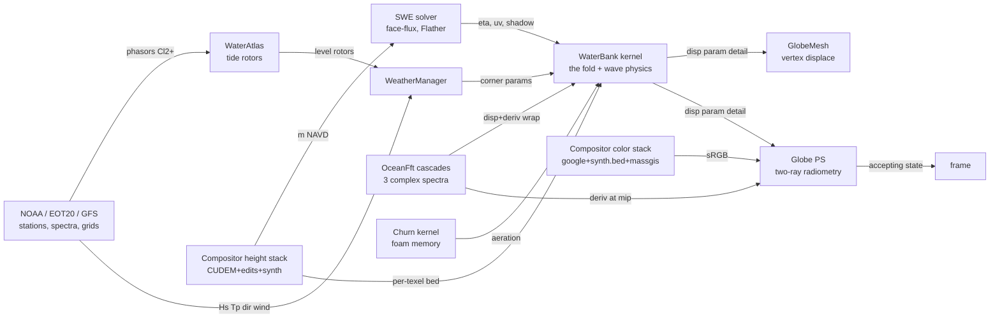

# THE ALGEBRA — GAGAME's mathematical machinery, in one place

This is the reference whitepaper for every algebra the engine runs: the geometric algebra
proper, the wave physics, the radiometry, the frame calculus, and the compositor's
bookkeeping. It exists so that a fresh session (or an outside expert) can load the whole
mathematical mindset from one document instead of re-deriving it from scattered shader
comments — and so that **divergences between textbook priors and what this project
actually measured** are recorded where they cannot be un-learned (see `priors — The
priors ledger`, which is the section to read FIRST when something feels off).

Conventions used throughout: world frame is the flat one-world map (+x east, +z north,
metres, anchored at ACT0816; see `frames`); heights are metres NAVD88; angles radians
unless noted. Each section ends with Code / Gates / AST anchors. The scriptorium serves
these sections via the `math` tool (`math()` lists topics, `math(topic)` prints one).
Machine contract: sections are `## topic-id — Title`; do not rename ids casually — the
scriptorium ingests them by id.

The state diagram (nodes are engines, edges carry the products; the full frame table with
flips and ranges is generated every run into `docs/GA_AST.md`, the machine-readable graph
into `docs/ga_ast.json` — the future node-editor's file format — and the drawn catalog
into `docs/diagrams/ga_full.svg` + per-domain pages via `tools/astdiagram.py`):

## pga — Motors: Cl(3,0,1) and the camera's rigid algebra

The projective geometric algebra Cl(3,0,1) (degenerate metric, e0² = 0) carries every
rigid transform as a **motor** M in the even subalgebra: rotor ⊗ translator, acting by
the sandwich

    X′ = M X M̃

on points/lines/planes uniformly. The engine uses motors for camera pose composition and
the rails: a pose is a motor, a rail is a curve of motors, and interpolation is the
**screw slerp** — log each motor to its bivector screw (axis + pitch), lerp in the log,
exp back:

    M(t) = M₀ · exp( t · log(M₀⁻¹ M₁) )

which yields constant-twist motion (rotation and translation advance together along the
invariant screw axis — no separate lerp of position/quaternion, no gimbal artifacts, and
composition M₂M₁ is associative rigid chaining by construction). Orbit keys and helm
poses (`poseMotor`, `orbKey`, `railPose`) are all motors; a rail is `vector<(t, Motor)>`.

Invariants pinned by the gate: sandwich preserves distances (rigidity), offset-axis
rotation lands where the matrix path lands, log∘exp is identity on screws, slerp
endpoints reproduce the keys.

Code: `src/core/Pga.h` (the multivector layout + products), `main.cpp` railPose.
Gates: `pga` (motor self-test). AST: camera edges are implicit (world frame both sides).

## cga — The conformal model Cl(4,1): the sun as a place, and the space as a versor

`pga` carries rigid motion but cannot carry a **sphere**, and in a degenerate projective
algebra a point and a direction are the same object. That was tolerable while the sun was
two floats of art direction (`sunAzimuthDeg = 112`, `sunElevationDeg = 26`, no date, no
latitude, no distance). It stopped being tolerable when the sun became a thing at a place.

Cl(4,1) is Euclidean 3-space plus a **null pair** built from one extra positive and one
negative basis vector:

    n₀ = (e₅ − e₄)/2,  n∞ = e₄ + e₅,   n₀² = n∞² = 0,   n₀·n∞ = −1

and a Euclidean point x embeds as the null vector

    P = n₀ + x + ½x² n∞,      P² = 0,   P·n∞ = −1

from which everything follows: **P·Q = −½|p−q|²** (distance with no square root), a sphere
is P_c − ½r² n∞, a plane is n + d n∞, and translation, rotation and **scaling** are all
versors acting by one sandwich V X Ṽ. Intersections are the outer product: the day/night
**terminator** is `Earth ∧ π_polar`, a grade-2 circle blade, and "is this point on it" is one
left contraction, whatever the object's grade.

**The unit length is part of the model.** The embedding squares the coordinate into the same
two basis vectors n₀ occupies, so once ½|x|² passes 1/(2ε) the origin's ±½ is annihilated and
P·n∞ becomes exactly 0 — and a conformal vector with P·n∞ = 0 *is* a point at infinity. In
metres that happens at |x| = 9.49e7 m: geostationary orbit survives, the Moon does not, and the
sun is a direction again. Each space therefore declares its own unit length — `solar.au` at 1 AU,
`planet.re` at R⊕ — and moving between them is a **dilator**, not a reinterpretation. Eleven
orders of magnitude, one versor. (Priors 32.)

**The sun's frame chain** (`Ephemeris.h`) is four versors and one sandwich:

    T  translator   put the Earth's centre at the origin      (heliocentric → geocentric)
    R  rotor        −GMST about the celestial pole            (inertial → Earth-fixed)
    M  reflection   swap the last two axes                    (ECEF → the engine's frame)
    D  dilator      1 AU → 1 R⊕ of unit length                (the SPACE change)

M is a reflection because the engine's planet frame is **left-handed** (at lat 0 lon 0:
east = +z, north = +y, up = +x, so east × north = −up) while ECEF is right-handed. A rotor
cannot express that; an odd versor can. (Priors 34.)

What the placement buys that a direction could not: the sun's **angular radius** (0.2621–0.2710°
over a year, which the sky's disc is now drawn from — the constants it replaced spanned
0.44–0.99°, so the sun was 1.7–3.7× too wide), its **irradiance** (1316.6–1407.7 W/m², the
annual 3.4%), the **finite-source parallax** (≤ 8.79″ = R⊕/d, taken once at the camera), and a
terminator that is the tangent-cone contact circle rather than a great circle (offset R²/d =
269 m, radius short of R by 6 mm — geometrically real, visually nothing; the 59 km softness of a
real terminator comes from the sun's *disc*, and the ~18° twilight ramp the engine already had
is atmospheric, not geometric).

Code: `src/core/Cga.h` (the full algebra — 5-bit blade masks, 32 doubles, one geometric
product; everything else written through it), `src/sim/Ephemeris.h` (the sun). Gates: `cga`
(1113 checks: null pair, up/down + homogeneity, the distance law, each versor's sandwich and
their composition, sphere/plane/meet incidence, the unit-length collapse), and `gatest`'s sun
block — the versor chain against the trig closed form (2e-12 over 366 samples), **solar noon at
the Merrimack mouth on 2026-08-28 against an external ephemeris (−0.2 s of 16:44:25Z)**,
distance/declination/angular-radius bands, the terminator meet, and the parallax ceiling.
AST: `sim.clock → solar.sun → {globe.ps, sea.ps, globe.mesh}`.

## cl3 — Vector algebra of Cl(3): reflection and refraction as versors

The pixel shader's optics are grade-1 sandwiches in ordinary Cl(3):

**Reflection** of a direction d about unit normal n IS the versor sandwich

    r = −n d n = d − 2(d·n)n

(the right side is the expanded form the shader runs; the left is what it *is*). Used for
the water's reflected sky ray.

**Refraction** (Snell) is a **rotor in the incidence plane**: with B̂ = (d∧n)/|d∧n| the
unit bivector of the incidence plane, θᵢ the incidence angle, θₜ = asin(sin θᵢ/η′) the
transmitted angle (η′ = n₂/n₁ = 1.34 for air→water), the transmitted direction is

    t = R d R̃,   R = exp(−(θₜ−θᵢ)/2 · B̂)

whose closed form (what the shader runs, with η = 1/1.34, cᵢ = −d·n):

    t = η d + (η cᵢ − √(1 − η²(1−cᵢ²))) n         if η²(1−cᵢ²) < 1
    t = d + 2cᵢ n                                  (total internal reflection → sandwich)

The gate constructs R explicitly from the bivector and verifies the closed form equals
the sandwich for random incidence, including the TIR boundary.

Code: `shaders/Globe.hlsl` (M7c "THE TWO RAYS" block). Gates: `gatest` (sandwich +
refraction rotor). AST: `world.flat` frames both sides (no transform edges involved).

## cl2 — Spinors of Cl(2)+: tidal phasors and every 2-component fiber

Cl(2)⁺ ≅ ℂ. A tidal constituent's state at a point is a **phasor** P = (re, im) — a
spinor whose magnitude is amplitude and argument is phase. The laws:

**Synthesis** (CPU rotors, per frame): water level at time t from constituents c with
angular speeds ω_c (deg/hr: M2 28.9841042, S2 30.0, N2 28.4397295, K1 15.0410686,
O1 13.9430356):

    h(x, t) = msl(x) + Σ_c  Re[ P_c(x) · e^{iω_c (t − T0)} ]

**Interpolation law**: phasor fields blend **componentwise on (re, im)** — bilinear on
amplitude/phase is WRONG across a phase gradient (it collapses amplitude; the chord of a
rotating unit vector is shorter than the arc, and worse, phase wraps). Componentwise
re/im interpolation is the geometrically sound spinor blend. This law governs the
FieldChannel realizations (RG16F tiles), station IDW (p=2 on phasors), and EOT20
ingestion.

**Epoch alignment**: joining two phasor sources with unknown relative epoch, the least-
squares rotation is

    δ = arg Σ_s  P_s · conj(Q_s)

(rotate one set by e^{iδ}; used to align EOT20 against the station fits).

The same Cl(2)+ fiber carries currents (u,v) and any 2-component field in the
compositor's `FieldSource` contract.

Code: `src/compose/WaterAtlas.*` (sources, ladder, self-test), `Compositor::
SampleFieldStack`. Gates: `watertest` (fit reproduction 0.0 mm, tile-vs-stack identity,
seam 2.1 mm). AST: `compose.stack` field edges (latlon → mercator, flip at paint).

## fft — The cascade sea: three complex spectra

The ambient sea is three independent FFT cascades (patch sizes L = 756 / 186 / 47 m at
256², texels 2.95 / 0.73 / 0.18 m), each a directional spectrum realized to a
displacement texture (dx, dy, dz) + a derivative texture (∂x, ∂z slopes + Jacobian). Band
k-space is partitioned at cuts kCut = 2π/756, 2π/60, 2π/12, 0.9π·256/47 with each band's
**representative wavenumber** the geometric mean of its cuts — the single k that stands
for the band in the fold and the wave physics:

    k_c = √(kCut_c · kCut_{c+1})     (λ_c = 2π/k_c ≈ 213, 26.9, 2.2 m)

The Jacobian's negative excursions mark plunging crests → the foam channel (s.w).
Sampling is world-position wrap: uv = frac(xz / L_c) — same convention in the bank
kernel, Sea.hlsl, and the Globe PS (AST: `patch.wrap +v=N`, no flip anywhere).

Code: `src/scene/OceanFft.*`, `SeaLayer` cascade plumbing, `WaterBank.hlsl` fold loop.
Gates: seaVerify (rendered Hs vs model Hs ±10%). AST: `ocean.fft → water.bank/globe.ps`.

## fold — Grade shedding: the multiscale energy ledger

THE law that makes one water work at every altitude. A band with wavelength λ sampled by
texels of size T carries **geometry** only while the texels resolve its phase; past
Nyquist it must not alias — its energy **sheds to statistics** (slope variance σ²,
consumed by the glint BRDF). The fold weight:

    w(λ, T) = 1 − smoothstep(0.12λ, 0.5λ, T)

Displacement adds s·w·A; the shed complement adds to variance:

    σ² += (1−w) · A² · mss_c,   mss = (0.0004, 0.0018, 0.0060) per band

where A is the band's local amplitude gain (`physics` below). Because both sides carry
A², total energy is conserved across any texel size — coarse rings hold as statistics
exactly what fine rings hold as geometry, so ring handovers cannot pop energy.

**The three-tier telescope** (per pixel, per band): wRing = w(λ, ringTexel) is what the
bank's geometry carries; wPix = w(λ, pixelFootprint) is what this pixel could resolve;
the difference

    wDet = saturate(wPix − wRing)

is recovered in the PS from the full-resolution derivative textures (normal detail +
sparkle), and σ² hands back the same share. At altitude wPix ≤ wRing and every term
vanishes; at the helm wDet fills the gap. No altitude branches — the tiers telescope by
construction.

**The folding law** (learned twice, M6t and M7s): *never threshold or gate a
box-averaged field — average the thresholded answers.* Folding commutes with linear
operations only; any nonlinearity (a classification cutoff, a breaking threshold) must
be applied at fine scale and its **answers** averaged (coverage), or coarse LODs invent
qualitatively wrong content (the smooth-brown-earth bug: a marsh's box-averaged bed
slid under a classifier cutoff that no fine sample crossed).

Code: `shaders/WaterBank.hlsl` (kernel fold), `Globe.hlsl` M7a detail loop, `Sources.cpp`
BedSynthSource (coverage fold). Gates: `gatest` (fold telescope identities). AST:
`ocean.fft` edges; ranges column carries the amplitude budgets.

## physics — Finite-depth wave physics: dispersion, shoaling, blocking, breaking

Per band (representative wavenumber k, local depth h, collinear current U∥):

**Dispersion / phase speed**:  c(k,h) = √( g/k · tanh(kh) )

**Group speed**:  c_g = ½ c (1 + 2kh / sinh 2kh)

**Shoaling** (Green's law, energy-flux conservation as c_g drops):

    S = √( c_g^deep / c_g ),  clamped to [0.75, 1.7]

**Wave–current amplification** (wave action over an opposing/following current;
r = U∥/c₀):

    c′/c₀ = ½ (1 + √(1 + 4r))          (relative phase speed)
    A_wc  = 1/√( (c′/c₀)² (2c′/c₀ − 1) ),  clamped [0.55, 2.0]
    blocking as r → −¼:  A_wc saturates to 1.45 and the blocked fraction
    b = smoothstep(−0.16, −0.245, r) drives breaking foam instead

(the −¼ blocking point is exact linear theory; the 1.45 saturation and the smoothstep
band are engineering closures — real waves break rather than blow up).

**Local amplitude gain** per band: A = hsScale · exposure · S · A_wc, where hsScale is
the GFS-Wave Hs over the cascade reference, and **exposure** is the swell shadow: a CPU
line-of-sight march toward the peak-wave source over the live bed (≈0.12 in geometric
shadow, floor 0.18 in the bank for local chop).

**Depth-limited breaking** (bank kernel, after displacement): |η| ≤ 0.55·h, excess
converted to foam; matches the classical H ≤ 0.78 h with H = 2η.

**The 7-foot-standing-wave term** (why the entrance stands up): an 11 s swell in 4 m of
water has c ≈ 6 m/s, so a 1 m/s ebb reaches r ≈ −0.17 — a third of the way to blocking —
exactly over the shallow bar. Deep water shrugs the same current off (c ≈ 17 m/s).

Independent verification: `proofs/inlet_storm.py` runs these same closed forms on the
engine's exported fields (numpy, no engine code); the match report holds the kernel to it
(shape-normalized corr ≥ 0.9 per ring, mean |log ratio| ≤ ~4%).

Code: `shaders/Jet.hlsli` (pure functions), `WaterBank.hlsl` (application),
`SeaLayer::BuildShadowMask`. Gates: `gatest` endpoint pins; the M7p match report.
AST: `swe.solver → water.bank` (shadow), `compose.stack → water.bank` (corners).

## swe — The shallow-water solver: face fluxes, Flather, the prism

Depth-integrated shallow water on an equiangular CUDEM grid (per-axis metric: dx = 10.08,
dy = 13.65 m — one latitude's cosine, frozen per axis, NOT square):

    ∂η/∂t = −∇·q + sponge,      q = h·u (face fluxes)
    ∂q/∂t = −g h ∇η − c_f |u| u / h + advection(off)

**Flather radiation west boundary** (the river feed): u = u_ext ± √(g/h)(η − η_ext),
with the exterior prism current u_ext = Q/(A_prism) from the upriver tidal prism
(kUpriverAreaM2 = 3.9e6 m²) — the boundary radiates what the interior cannot hold and
feeds what the exterior tide demands.

**The prism-debt term**: dη −= g_tideRate · dt inside the domain accounts for storage
the truncated upriver estuary would have absorbed (tideRate finite-differenced from the
atlas rotors); without it the truncated domain floods high.

Sponge on the seaward edge (x ramp), jetty walls as reflective masks, eta/uv atlases
row-0-north (every consumer flips; see AST).

Validation: throat current vs ACT predictions r = 0.959, lag +4 min, gain 1.0.

Code: `shaders/Swe.hlsl`, `src/sim/SweSolver.*`. Gates: solver soak in watertest-adjacent
harness; the flood-rail visual. AST: `swe.solver → water.bank/sea.ps` (FLIP edges).

## radiometry — The two-ray water and the lit planet

A water pixel is a Fresnel split between two rays, both answered by data the engine
already owns (no BLAS — the scene descriptions are our own quadtrees):

    L = F(θ)·L_sky(r̂) + (1−F)·[ T_w ⊙ ρ_bed·E_bed + (1 − T_w) ⊙ C_scatter ] + L_glint

- r̂ = −n d n (reflected ray, `cl3`), L_sky the analytic sky radiance (discless sun +
  gradient), F = Schlick 0.02 + 0.98(1−cosθ)⁵ on the true wave normal.
- The refracted ray (`cl3` rotor) marches into the water and lands on the **bed** — the
  composed height quadtree, found by 2 secant steps; ρ_bed is the composed color there
  (imagery or synth.bed's dry albedo).
- **Beer–Lambert** per channel over the real path (down along the ray + diffuse up):
  T_w = exp(−K_d (s↓ + h)), K_d = (0.36, 0.105, 0.06) m⁻¹ coastal — red dies first,
  which IS why shoals read turquoise from orbit.
- C_scatter is the shelf water color; deep water: T_w → 0 and the formula collapses to
  the far-field the globe always drew (the telescope again, in radiometry).
- **Cox–Munk glint**: facet-slope variance σ² = 0.003 + 0.00512·U₁₀ far-field, replaced
  in-bank by the fold's shed σ²; the lobe is the classical exp(−tan²θ_h/σ²)/(4πσ²cos⁴θ_h)
  with its own Schlick factor. The **group envelope** modulates it: σ² ← σ²(0.70 +
  0.60·env) with env the pixel-resolved slope magnitude — spatial glitter grain that
  telescopes off by ~10 km footprints.
- Foam whitens albedo (bank foam channel + churn memory); land takes imagery with the
  hand-edit rock override; sRGB pixels ship as captured (no re-grading — see priors).

**The atmosphere ledger — every pixel gets air exactly once** (audited M9bi, after the
question was asked directly). Four things in this engine are "atmosphere", and they are
disjoint by construction, not by luck:

| term | where it applies | what stops it doubling |
|---|---|---|
| `AerialPerspective` (haze, 1.3 km scale height) | Sea.hlsl water (both shading paths, once at the end); Globe.hlsl's M6j close-up material; Terrain.hlsl | the Sea PSO is opaque (`ONE`/`ZERO`), so it *replaces* the globe's pixel rather than adding to it; the M6j block is gated `landness > 0` |
| the cloud-volume march | Globe.hlsl PsMain, once, between the shell entry and the ground | one block, one `col = col*T + scat` |
| the from-space rim | Globe.hlsl PsMain, faded in above 60 km altitude | complementary to the shell: rim is *on* the disc, the shell is *off* it |
| the Rayleigh shell (`PsSky`) | fullscreen backdrop at reversed-Z infinity with `GREATER_EQUAL` | touches only pixels nothing has drawn |

The one asymmetry the audit did find is a MISSING atmosphere, not a doubled one: **the globe's
water takes no `AerialPerspective` at all** (the near-haze block is land-gated), so in
`--one-water` mode the sea's distance fade is carried entirely by the Fresnel sky mirror going
to 1 at grazing — which is the physically dominant term there, but it is not the same thing the
SeaLayer does to the same water. Recorded rather than changed: it is a look decision.

Code: `shaders/Globe.hlsl` (M7c/M7e blocks), `Common.hlsli` sky. Gates: visual parity
stills; gatest covers the versor pieces. AST: `water.bank → globe.ps`, `height.window →
water.bank`.

## frames — The frame calculus: one world, five transforms, one table

Everything positional moves through declared frames (the GA AST — `docs/GA_AST.md`,
regenerated every run, validated at boot and in gatest):

- **world.flat** (+x east, +z north, metres): the anchor-linear map lat = orgLat +
  z/mPerLat with mPerLon frozen at the anchor. Absolute drift ≤ ~0.2 km at the window's
  far corners — but every water consumer shares the map, so the water cannot disagree
  with itself. This is a deliberate approximation, not an error.
- **Mercator**: mx = (lon+180)/360 · N,  my = (½ − ln tan(π/4 + φ/2) / 2π) · N. The
  north/south inversion lives INSIDE this closed form — the latlon→mercator edge carries
  flip=true; mercator→uv sampling carries none (both v-south). Misdeclaring this is the
  validator's favorite catch (it has caught its own author).
- **Row-0-north rasters** (CUDEM, SWE atlases, shadow): every sampler flips
  (v → 1−v). The writers say so in their headers; the AST enforces it.
- **patch.wrap / atlas.texel** (+v = +z north): FFT cascades, bank rings, churn — no
  flips anywhere in that family.
- **Float precision**: the shader-side mercator chain (float32, absolute px) carries
  ~0.25 px ulp ≈ 1.64 m worst ground error over ±40 km (gatest-bounded < 4.5 m); all CPU
  sites run doubles.

Gates: `gatest` (flip rule, orphan rule, ledger truths, merc bound), boot validation.

## compose — The compositor's algebra: ordered lerps, hashed identity, folded coverage

The composed planet is an ordered per-pixel lerp stack (bottom→top), each source
returning a weight (coverage·feather) and a value; **alpha is fiber** — it blends per
pixel, never per tile. Authority is stack ORDER (google < synth.bed < massgis < user
overlays; survey < hand edits).

**The soak rule** (cache identity): a tile's identity hashes exactly the sources that
meaningfully touch it (footprint intersects AND spans ≥ ~2 texels at that LOD), so an
edit repaints exactly the touched tiles at every rung and nothing else, forever.
**Identity is content**: file-backed sources hash their bytes into their structure
string; synthesis nodes hash their program + their INPUTS' signatures (synth.bed hashes
bed_rules.json + zones + the height stack).

**Coverage folding** (M7s): classification alphas at coarse LODs are computed by
subsampling the decision at fine scale and averaging the answers (see `fold`).

**The tree of trees** (M9am): a compositor is itself a source (`CompositeSource`), so
composition nests; `TileTree` caches EVERY node's output on the NVMe on the shared tile
addresses. Two laws make a composite a valid input: **straight alpha** — the over is
un-premultiplied (`OverFinish` divides by coverage), so a single-input compose at partial
weight IS its input byte for byte and is stored as a zero-byte **reference** naming the
child tree; and **identity is the inputs** — a node's identity folds its children's, a
tile's key folds what each child holds at that address, so a composite updates when a
source's tiles change and at no other time. A **gate** (`GateSource`) is a third kind of
edge: the value is the layer's, only the weight is the product; *absent* (no opinion)
and *void* (blocks) are different answers.

Code: `src/compose/Compositor.*`, `Sources.*`, `ComposeTree.h`, `TileTree.h`,
`GisMask.*`. Gates: `composetest` (paint order, weights, alpha, cache identity,
addressing vs closed forms), `atlastest`, `--tree-audit` (tree vs incumbent, tile for
tile, worst |Δ| ≤ 1/255). AST: all `compose.stack` edges.

## discrete — The small algebras: noise, decay, morph, the float wall

- **Value noise** (bed grain, rock): integer-lattice hash (splitmix-style avalanche) →
  smoothstep-bilinear; octaves folded by texel footprint (amp · clamp(λ/T, 0, 1)) — shed,
  don't alias (the fold law in miniature).
- **Churn decay/refresh**: memory = max(old · e^{−dt/τ}, deposit) — crisp fresh streaks
  over an exponential wash.
- **CDLOD morph**: vertex grid position g −= frac(g/2)·2·k with k the distance ramp —
  identical on both sides of every SAME-LEVEL seam; the height SOURCE morphs with the
  grid. It is NOT complete at a coarser neighbour's edge (the split is on the centre
  distance, the ramp ends at 2.93 coarse arcs, the coarse leaf's near corner can sit at
  2.29), so level seams are closed by the seam bands instead (priors 28).
- **The seam bands** (mesh path): a seam is closed by a thin band behind it, never by
  moving a vertex — the interpolated `dir`'s ulp is 0.4 m of ground, so any
  retessellation flips 8-bit pixels far from the crack. The band's inner edge is the
  record's own seam vertex with only its depth changed (bit-identical screen xy: the
  shared edge stays single-covered), its outer edge the same vertex 0.002 cells outward
  (fine-path hairlines) or the coarse record's own vertex at our even positions, ≥ 1 m /
  0.01 cells inside the coarse leaf (level seams); the whole band is 0.5 % of the distance
  farther in ndc depth, so it loses to every real fragment and wins only where nothing
  was drawn. `--lens shell` reports a band fragment as A = 9: the hole map.
- **The float wall** (mesh path): fine meshlets carry a double-precision camera-relative
  anchor + the position Jacobian d(pos)/d(uv); vertices reconstruct as anchor + J·du with
  small integer offsets — no 6.4e6-magnitude float subtraction anywhere near the helm.
  Linearization error at 650 m span ≈ span²/2R ≈ 3 cm.
- **Residency mip floor**: window pyramids' mips 4..7 wanted every frame — the coarse
  rung always exists, so fallback is always one coherent capture.

Code: `Sources.cpp` (noise), `SeaChurn.hlsl`, `GlobeLayer.cpp` / `GlobeMesh.hlsl`.
Gates: `tiletest` (atlas contract), composetest addressing.

## wavefield — The solved wave field: dispersion under current, the limiter, the phase spinor

The M8 water leg's centerpiece: instead of modulating a spatially uniform FFT sea by
per-texel amplitude gains, solve the stationary wave boundary-value problem per cell and
CACHE it — per spectral component i, a per-cell amplitude a_i, wavenumber k_i, and
integrated spatial phase carried as a unit spinor (cos φ, sin φ). Time enters only as the
rotor e^{−iσt}. Ported from the vqview-inlet reference (its wave_model, held to it by the
twin test below at the 8-bit quantization floor).

**Dispersion under current.** Per cell: (σ + k·U_opp)² = g·k·tanh(k·h), with σ the
conserved absolute frequency, U_opp = max(−U·d̂, 0) the opposing current. Roots come in
pairs (physical/swept) that MERGE at blocking; at the root f′ = 2σ_r(U_opp − c_g,r) → 0,
so Newton is structurally unsafe here (the reference measured a 628 km wavelength from
it). Scheme: 96 log-spaced candidates in [1e-4, 10^0.7] rad/m, first +→− sign change
(provably the physical branch), 48 bisections; NO sign change ⇒ the BLOCKED mask — the
wave is arrested, standing, breaking; flagged, never papered over. Deep-water blocking
sits at U_opp = c₀/4 exactly — the origin of `Jet.hlsli`'s −0.245 threshold. Blocked
cells hold k = 0.25·10^0.7 ≈ 1.2530 rad/m, a GRID-TUNED closure: k·Δ = 1.88 < π at
Δ = 1.5 m; a different cell size must re-derive it from k·Δ < π.

**Shoaling.** Ks = √(cg₀ / max(c_g + U_along, 0.15)) — energy-flux conservation, i.e.
wave-action conservation with the factor √(σ_r/σ) dropped (underestimates opposing-current
amplification by up to √2 ≈ 1.414 at deep blocking). The engine's factorization is
complementary: `Jet.hlsli` WaveCurrentAmp is provably the EXACT deep-water action
solution including σ_r/σ (verified 4e-16 over r ∈ [−0.24, 0.3]), and ShoalFactor is exact
finite-depth action shoaling without current. The solved field supersedes both for
DISPLAY inside its window; the closures stay for the foam/churn path and the fallback sea.

**Refraction.** Snell against one fixed bar-normal frame (compass 285): per-COMPONENT
incidence θ0_i from the component's own direction (using the mean direction gets 15 of 16
components wrong), sin θ = sin θ0 · c/c0 with the SOLVED c, Kr = √(cos θ0 / cos θ) ≤ 1
(spreading only — no focusing, an accepted liberty of the fixed frame). The direction
change is a rotor in e1∧e2 (one-sided Cl(2)+ multiplication, the tide-phasor law), but the
reference applies only the amplitude consequence: d̂ stays the offshore direction, and the
port that diffs against the reference textures must keep it so.

**The total-Hs limiter.** Depth limits the SEA, not each spectral line: per-component caps
left the sum 6.8× over the limit in the shallows (measured 63.9% of cells at N=4, 96.8%
at N=16); capping the coherent sum Σa bites in deep water (it dropped offshore Hs 3.12 →
2.25 m) because Σa grows like N while Hs grows like √N. The law lives on the rms envelope:
Hs = 2√2·rms ≤ 0.60·h, one UNIFORM scale factor on every a_i (spectral shape and
directions survive), and excess = rms_raw/rms_limit > 1 is the breaking indicator — "does
the sea here want to be taller than the water allows". (0.60 is the observed Hs
saturation; the bank kernel's |η| ≤ 0.55·h is the separate Hmax-family closure at a
different pipeline point — never conflate them.)

**The phase gauge and the spinor.** Each component wants ∇φ = k·d̂; that field is curl-free
only where depth contours ⊥ propagation, so a definite GAUGE is chosen: cumsum of k·d_e
along x plus cumsum of the ROW-MEAN of k·d_n along y (a single reference column would
print its depth profile as horizontal bands). Gauge anchors that must be declared or the
field is ambiguous: φ = 0 at the northwest corner texel center; x runs west→east
left-inclusive; y integrates the row-mean southward. Phase ships as (cos φ, sin φ) — the
cl2 law verbatim; bilinear error of unit spinors is ≤ 0.16·δ³ with δ = k|d_axis|Δ/2
(peak band ≈ 2e-3 rad at 18 samples/λ, below the 8-bit storage floor; worst single-axis
case 0.131 rad at the blocked-k hold, whose 0.25 factor exists to keep δ < π/2).

**The discrete spectrum.** N=16 components: f_i = geomspace(0.62·fp, 2.30·fp), JONSWAP
γ=1 shape, w_i ∝ √(S·df) renormalized so Σw² = 1, a_tot = Hs·√2/4 (exact variance:
σ_η² = a_tot²/2). Directions from the golden sequence g_i = frac(i·0.618034),
dir_i = mwd + 26°·(2g_i − 1): consecutive components jump ±20-32° (a linear ramp spaces
them 3.5° and its collinear low-frequency neighbours beat into long unbroken crest lines).

**Twin test** (`proofs/wave_field.py` + `proofs/vqview_ref.py`, on the reference's own
bathy/current/scenario): per-component k and a agree with the reference's cached textures
to EXACTLY half an 8-bit LSB, phase spinor dot ≥ 0.999985 — the solver IS the reference,
digit for digit. Wet 81.3%, Hs p50 2.384 m, excess>1 on 42.6% of wet cells, blocked 0.00%.

Code: `proofs/wave_field.py`, `proofs/vqview_ref.py`, `shaders/Jet.hlsli`.
Gates: `gatest` block 6 (dispersion residual, branch selection, blocking margin,
WaveCurrentAmp≡action, Green's law, limiter invariants, spinor error bound, Nyquist hold);
the twin test.
AST: wave.solver edges (bed/current/spectrum in, per-component planes out) — registered at
engine wiring; the flip table lives in the derivation (bathy row-0-north FLIP in,
uv01.vS FLIP out, d̂ is a VALUE and never flips).

## caustics — The tangent bivector: one object, the normal and the ray-map Jacobian

**The Gerstner wave is a rotor field**: particle displacement = R(a·ŷ)R̃ with
R = exp(−B·θ/2), B = d̂∧ŷ — expanding gives the (a cos θ)ŷ − (a sin θ)d̂ pair the shaders
ship. Finite depth is the SAME rotor under an in-plane anisotropic versor
S(v) = ½(α+β)v + ½(α−β)d̂vd̂ — chop (the engine's Λ = 1.1) is the α/β closure. The
displacement Jacobian J = −s·Σ aᵢkᵢcos θᵢ (d̂ᵢ⊗d̂ᵢ) is SYMMETRIC because each component's
displacement and gradient share one rotor plane — the engine's single jxz channel is that
theorem in k-space.

**The tangent bivector** T = t_z ∧ t_x of the displaced surface yields BOTH: the lighting
normal (its dual) and the caustic ray map's first factor (its horizontal part),
areaJac = |det(I+J)| — crests compress by 1−s·a·k, troughs stretch. heightScale multiplies
the height gradient only, never the horizontal Jacobian.

**The ray map**: a sun ray tagged by its surface entry q maps q → q + D(q) → bed, with
Jacobian factorizing into areaJac × (1 + h·K·∇²η), K = 1 − 1/n = 0.2498 (≈ the shipped
0.25, gap 1.9e-4). ∇²η = −Σ aᵢkᵢ² cos θᵢ — exact, analytic, no finite differences. The
curvature must be sampled at the SUN ray's entry point e = bed − sunRun,
sunRun = (sunW.xz/sunDown)·h — skip it and the caustics slide with the camera.

**The adjudicated ledger.** The reference's shipped gain
1/(areaJac·(1 − h·K·lap)) diverges from first principles in two ways (curvature sign;
per-reference-area vs per-physical-area flux bookkeeping) that partially cancel in its
regime. Ray-density ground truth (2²² full-Snell rays) settles it: the PHYSICAL form —
gain = 1/det(I + h·K·H_phys), with the crest identity H_phys = ∇²η_param/areaJac² and the
corrected 1-D curvature η″_phys = −a·k²(cos θ − s·a·k)/(1 − s·a·k·cos θ)³ — correlates
0.9987–0.9993 with truth where the shipped form reaches 0.827 (and goes DARK under
crests of a pure sinusoid where truth is bright). GAGAME ships the physical form.

**Cascade assembly** (the engine has fibers, not 16 components): per cascade the
derivative texture already carries J_c = det(I + Λ∇D_c); fold-weighted assembly
areaJac_fold = 1 + Σ_c w_c(J_c − 1) is exact in trace and exact outright for one active
cascade. The Laplacian is LINEAR so folding commutes exactly: ∇²η_c = iFFT(−|k|²·η̂_c),
one spectral multiply landing in the free u0.w channel of `shaders/OceanCompute.hlsl` —
the k̄_c² shortcut is REJECTED (k² varies ×158 inside band 0; a representative wavenumber
serves k-weighted physics, never a k²-weighted one). Washout: sun-disc blur ≈ h·0.0093,
fade smoothstep(4, 20, h), clamp [0.35, 2.6] — closures. The fold LOSES caustic contrast
where bands shed (variance (hK)²⟨lap²⟩) and never invents content — the safe side of the
folding law; per rendered bed pixel the shed-band mean gain is exactly 1.

Code: `proofs/caustic_jacobian.py`, `shaders/OceanCompute.hlsl`, `shaders/Globe.hlsl`.
Gates: `gatest` block 7 (closed forms, areaJac≡1 at s=0, corrected curvature vs numeric,
crest identity, K gap, flat gain ≡ 1); the ray-density proof.
AST: ocean.fft deriv (J, ∇²η) → globe.ps bed term — registered at wiring.

## ripple — The analytic tail and the footprint-bivector prefilter

96 normal-only components, 0.7–4 s (λ 0.78–24.5 m), a = 0.0156·√(20/N)·k^−1.25 —
amplitudes are millimetres (invisible as geometry, dominant in Fresnel/glint). p = 1 is
the exactly scale-free slope spectrum; −1.25 is a −1.5 dB/octave red tilt, an engineering
closure. Amplitudes scale 1/√N because independent phases add in VARIANCE (the 1/N
phase-locked rule understated rms slope by √(20/96) = 0.46 — the glassy-water bug); total
mss has the closed geometric-series form 2.29679e-3 (N-invariant to 0.03%). Directions
AND phases ride irrational rotations (golden φ̂ for directions, the plastic constant for
phases): the three-distance theorem gives max gap 1.26/N, consecutive directions jump
±20-32°, and Weyl sums bound cross-component interference O(1), not O(N) — phase-zero-
at-origin instead produces a fixed herringbone lattice that no band-limit can touch
(it is real structure, not aliasing).

**The prefilter is exact, not tuned.** The pixel footprint is the frame {fpx, fpz} =
(ddx, ddy of world position); modelling the pixel as a Gaussian of σ = ½ its extent, the
expected attenuation of wavevector k is the footprint's Fourier transform evaluated at k:

    w = exp(−|(½·k·fpx, ½·k·fpz)|²/2)

— two dot products, zero thresholds, exact phase preservation (the filter never moves
crests). The footprint's exterior square fpx∧fpz is the same grade-2 object as the
tangent bivector one scale up; the filter's quadratic form M = JJᵀ carries the sliver
anisotropy (tr M, det M = |fpx∧fpz|²) that NO scalar band-limit can express: at grazing
incidence L_∥/L_⊥ = r/h reaches 10–100, and the measured failure modes are ×3000 error
(isotropic-max: across-view ripples killed, glass) or ×7000 (unfiltered: along-view
ripples alias into crawling low-frequency shimmer). Deep-water k = σ²/g is valid over
h ≥ 6 m to 1.2% slope-weighted.

**Engine adaptation**: wRing (texture representability, hard Nyquist wall) KEEPS its
smoothstep; wPix (the prefilter question) upgrades to the per-axis Gaussian closure —
and the σ² handback must switch to the variance-true pairing (w for slopes, 1−w² for σ²,
telescoped as saturate(wPix² − wRing²)) or the Gaussian's wide tails leak energy across
the transition. Bonus: the shed variance arrives split along the footprint axes — the
anisotropic slope covariance a directional glint lobe wants.

Code: `proofs/ripple_prefilter.py`, `shaders/Globe.hlsl`.
Gates: `gatest` block 8 (w(0)=1, isotropic reduction, Gram bivector identity, rotation
equivariance, mss closed form + N-invariance, golden three-gap, telescope endpoints).
AST: ripple tail is analytic in-shader (no texture edge); the prefilter rides the
existing ocean.fft deriv edges.

## foamlaw — Foam discipline: triggers, the crest gate, breakup, and churn as memory

**Peak vs rms.** rms envelope = √(Σa²), coherent peak = Σa, ratio √N (measured 1.9 at
N=4, 3.6 at 16). Normalizing η by rms and clamping flat-bottoms every visible trough;
shape = tanh(1.6·η/peak) is strictly monotone, never saturates (tanh(1.6) = 0.9217), and
feeds skyVis ∈ [0.40, 1] and the ±9% crest catch-light — closures.

**Two triggers, one event.** (a) Steepness: MICHE = 0.44 IS the limiting steepness
(π·0.142 = 0.446; Stokes 120° gives 0.443); band [0.352, 0.528]. The engine's Jacobian
foam saturate((0.80 − J)·4) detects the SAME event through an affine bijection — for one
component min_φ J = 1 − Λ·a·k exactly, so onset sits at ak = 0.20/1.1 = 0.182 and
saturation at ak = 0.45/1.1 = 0.409 ≈ 0.93·MICHE: breaking is the crest's area 2-blade
degenerating, read in spectral coordinates. (b) Depth: excess = rms·2√2/(0.60·h) on the
ENVELOPE — never instantaneous |η|, which whitecaps the whole domain as television static
— gated smoothstep(1.05, 1.95) with a mean-neutral ±15% noise jitter of the threshold.

**The crest gate** smoothstep(0.28, 0.80, η/rms): foam rides crests only. For a Gaussian
sea the gate passes 22.6% of area (quadrature 0.2256); the reference's measured ungated
gouache was 30.7% (surf-zone skewness raises crest occupancy) collapsing to 2.1% gated —
coverage ratio ≥ 4 is the pinned behavior. **Breakup**: 3 value-noise octaves under
IRRATIONAL rotations (axis-aligned octaves share lattice seams → rectangular blocks),
range-faded per octave (the fold law in miniature) with the mean-preserving
renormalization n/Σ(c·w) — without it foam coverage becomes a function of camera
distance. **Composite**: foam = saturate(max(steep, depth, blocked)·crest)·(0.55+0.75·fn),
painted at peak opacity 0.72 toward (0.945, 0.965, 0.975) AFTER the refraction mix —
whitewater is a thin aerated layer, not paint.

**The engine's combined law** (churn = the term the reference lacks): instantaneous foam
is the crest-gated UNION of triggers (max, never + — the triggers detect one event and
adding double-counts it; adding churn on top brightened the throat into uniform fog);
churn is the SAME quantity remembered (deposit = foamInst, τ = 90 s decay); the composite
is max(foamInst, modulated churn)·dry. This is the named fix for "storm surf fuses to a
flat white sheet": each breaker deposits a distinct crest-shaped noise-broken streak that
decays on the 90 s clock — surf individuates.

Code: `proofs/foam_discipline.py`, `shaders/WaterBank.hlsl`, `shaders/SeaChurn.hlsl`,
`shaders/OceanCompute.hlsl`.
Gates: `gatest` block 9 (√N peak/rms, tanh bounds, crest-gate quadrature,
Jacobian↔steepness bijection, renormalization invariance, churn half-life 62.4 s).
AST: churn.kernel → water.bank foam edge upgrades its semantic (deposit = foamInst).

## wake — Kelvin wakes: the wedge as a discriminant, and the signed stationary phase

A steady wake is stationary in the ship's frame — stateless, like the swell. Station
keeping: c = U cos θ (θ = wave normal from track) ⇒ k = K₀ sec²θ, K₀ = g/U². The phase
φ(θ) = K₀(ξ sec θ + ζ sec θ tan θ) is stationary where 2ζt² + ξt + ζ = 0 (t = tan θ):
O(1) per pixel, both branches (transverse |t| small, divergent large; Vieta t₊t₋ = ½).
Real roots need ξ² − 8ζ² ≥ 0 — the famous 19.4712° half-angle IS the discriminant
(atan(1/2√2) = arcsin(1/3) to the last bit; nothing imposes it). The cusp merges the
branches at sec²θ = 3/2: k = 1.5·K₀, λ_cusp = ⅔λ_t. Speed is the whole character:
λ_t = 2πU²/g gives 15.1/13.7/9.4/7.1 m for the AIS per-class speeds. Brute-force θ
quadrature fails structurally (far-field phase decorrelation needs O(K₀R) samples);
solving the quadratic IS the stationary-phase method, exactly.

**The signed phase — where this port corrects its reference.** The stationary roots are
NEGATIVE for ξ,ζ > 0; the phase at them is φ = K₀ sec θ·(ξ − ζ|t|), already mirror-
symmetric. The reference shader folds |t| into φ = K₀(ξ sec + ζ sec|t|) — a
non-stationary angle: its measured |∇φ|/k runs 1.03–6.65 across the wedge where theory
demands exactly 1 (envelope theorem), its near-edge wavelengths collapse ~10× below what
its own band-limit believes, and its analytic slopes are not the derivatives of its η.
GAGAME ships the signed form with d = ∇φ/k = −(cos θ·fwd + sin θ·side·rgt) — φ and d flip
together (η is even in the pair) — and the gate the reference fails:
finite-difference |∇φ|/k = 1 within 1e-4 on both branches.

**GA**: the offset-track geometric product Ûr carries astern (scalar part), across
(bivector magnitude), and the side (bivector sign) in one multiplication; the vessel pose
is one PGA motor M = T(p)·R(ŷ, −hd) (sign pinned by the +x → −z rotation convention in
`src/core/Pga.h`), body-frame evaluation is the inverse-motor sandwich, and the chase
camera and riding rail are constant motors composed onto it, slerped along the screw.
Every bound (steepness cap ak ≤ 0.30, divergent damping exp(−(k/5K₀)²), mesh-Nyquist
band-limit smoothstep(2, 5, λ/sampleM) — against the MESH, never pixels — cusp boost
faded in over dRel 1–3.5, near fade 0.5–2.5 hull-lengths, draught amp cap, 1/√(0.6+dRel)
spreading) is an engineering closure with its physical argument recorded.

**Vessels**: attitude = least-squares plane fit over a symmetric 5×3 waterplane stencil
(the symmetry decouples the normal equations: heave = mean, slopes = ratios; exact on
planar input — a gate), pitch at unity, roll × 0.45 RAO (the honest stateless stand-in
for a damped righting oscillator), rigid frame per instance. The stencil is a fold of
ANSWERS and low-passes hull-length-vs-wavelength response for free (heave RAO
cos(k·halfLen), pitch RAO sinc(k·halfLen)). The riding camera needs no bake: two surface
evals (bow/stern) per frame give heave/pitch live; the pose is a motor on the arc-length-
parameterized AIS route (waypoints are even in longitude — index stepping surges).

Code: `proofs/kelvin_wake.py`, `src/core/Pga.h`.
Gates: `gatest` block 10 (discriminant angle both forms, root stationarity + Vieta,
|∇φ|/k = 1 on the signed phase AND > 1.5 on the folded reference form, class wavelengths,
plane-fit exactness, motor-frame invariance).
AST: vessel table + wake edges registered at wiring (world.flat positions, heading rad).

## bedalbedo — Data-driven bed relief, the sediment model, and the waterline gate

**The extractor is a CROSS, not a box**: relief = clamp(0.85·(z − mean of 4 taps at
±6 m), ±0.45). Transfer function Ĥ = 1 − ½(cos 6k₁ + cos 6k₂): axial zeros at λ = 6/n m
(BLIND to a pure 6 m axial bedform — honest limitation), unit axial peaks at λ = 12 and
4 m (the tidal-inlet sand-wave band), diagonal gain 2 at λ = 8.49 m (shipped anisotropy —
port verbatim), long-wave asymptote −7.65 m²·∇² (channel morphology suppressed ~30×).
Resolution honesty: the 1.5 m composite resolves the full band; a 5 m grid only the 12 m
shoulder; a 13.7 m CUDEM stack returns ≈ 0 — CORRECTLY (its compilation smoothing already
removed the structure; do not fake it with noise beyond the declared grain). Bedform
relief is an eHydro-class product and enters where `data/bathy` gains such a rung.

**The M7s fold**: the clamp is nonlinear, so coarse rungs average the ANSWER — pointwise
at rungs ≤ 6 m; n×n answer-subsample at ≤ 6 m spacing for 6–24 m rungs (the alpha-fold
loop shape in `src/compose/Sources.cpp`); coarser rungs take the mean-zero theorem
(relief → 0) and SHED the discarded variance into the procedural grain amplitude — grade
shedding, exactly as the wave fold sheds A² to σ². The skew subtlety (caught
adversarially, twice): any 12 m-periodic bed survives the extractor with odd harmonics
only, so its clamp has exactly zero mean — a skew demonstration needs a fundamental whose
SECOND harmonic the operator passes (λ = 8 m + λ = 4 m: clamped mean +0.0225 m).

**Sediment = model, not optics**: base = lerp(SAND, SILT, smoothstep(2.5, 11, depth)),
contrast fades 3→14 m — the energy-sorting argument (near-bed orbital velocity vs Shields
threshold: swept shoals keep bright sand, quiet channels keep dark fines). Declared DRY
albedo keyed on DATUM depth: the refracted ray's Beer–Lambert already darkens deep water
optically (double-counting guard), and baked inputs must be tide-invariant or cache
identity rehashes with the clock.

**Rock vs sand by narrowness, not slope**: gridded products smooth structures (jetty p90
slope 0.176 vs all-land 0.181 — no threshold exists; the same smoothing GAGAME measured
as riprap → leaky sills). Land-fraction in a 45 m box is a COVERAGE — box means preserve
integrals, so the footprint survives coarsening even though derivatives die. Window
[0.28, 0.62] maps jetty (lf ≈ w/2R ≈ 0.22) → rock, beach (0.79) → sand, against the
DATUM shoreline (structures don't move with the tide).

**Split-hemisphere ambient + one-bounce** (near-field land): E = E_sky(1+n·ŷ)/2 +
E_ground(1−n·ŷ)/2 — the view factors sum to 1 identically, and the split REDISTRIBUTES
the calibrated flat ambient, never adds to it (weighting sky by skyVis alone raised flat
sand 1/0.55 ≈ 1.8× to near-white). The 4-tap sunlit-neighbour bounce averages RECTIFIED
answers (fold-compliant before the law was named), gated to shadowed facets.

**The waterline gate**: a photo's waterline is an elevation contour at the flight's tide.
Classify wet = (b − r) + (0.45 − brightness) > 0.06 on the ortho, sweep level L,
A(L) = mean of boolean answers; the reference verified its datum at 93.2% this way.
GAGAME upgrades it: Mode F (free fit — internal datum consistency) and Mode P (pinned —
L predicted from the tide model at the ortho's capture epoch, |L* − L_pred| ≤ 0.3 m).
Datum resolution, settled: MLLW − NAVD88 = −1.400 m at the entrance via the Boston MSL
link; the reference's "1.68 m regional offset" is Boston's OWN link misapplied regionally
— never use it outside Boston. Multiple ortho vintages at different tide stages sweep
independent contours across the flats; excluded masks (no-data, hand edits, marsh) are
declared, never silent.

**The seafloor beyond the box (M9av)**: no photograph of the ocean floor exists to ingest, so
the seafloor's texture is a PRODUCT of the bathymetry the project already ingests -- the height
stack (ETOPO 4.9 km, the NE 15 s grid, CUDEM). `synth.seafloor.relief` = hillshade x dry
sediment ramp: the gradient of the bed (the grade-1 part of its derivative, central differences
at max(texel, data grain) -- a step finer than the grain reads the bilinear interpolant's
facets, which rendered the continental slope as terraces) exaggerated x25 and lit by one fixed
cartographic sun (az 315, el 45, ambient 0.45, normalized so a flat bed shades to exactly 1),
times a ramp keyed on DATUM depth (sand 0 m, silt by 200 m, clay by 4 km -- the same
energy-sorting argument, extended past the shelf). Global footprint, the bed classifier's
waterline band above with no deep cutoff, gated by the survey like the classifier, painted
UNDER the classifier in `earth.seafloor`. DRY albedo, as the classifier: the water's optics stay
the renderer's. Through opaque water (T_w -> 0 by a few tens of metres at measured K_d) the
two-flux endpoint IS the colour -- chlorophyll and SPM keep their say -- and the floor's shading
rides it as a brightness modulation: the renderer divides the ramp's own luminance (mirrored in
HLSL, `SeafloorRampLuma`) back out of the texel and what remains is the hillshade. A map
convention, declared as one, weighted by (1 - mean T_w) so the physical bed term owns the
shallows, removable by one constant (`kSeafloorRelief`).

Code: `proofs/bed_relief.py`, `src/compose/Sources.cpp`.
Gates: `gatest` block 11 (transfer-function zeros/peaks, skew vector, narrowness discrete
count, hemisphere partition, waterline flip-metric exactness); the waterline gate harness
is the named follow-on proof.
AST: synth.bed's height-stack edge gains the relief taps; the gate consumes composed
exports through the renderer's own provider path.

## optics — Water quality as radiometry: the two constants become two fields

`radiometry` left two constants in the ray path: the per-channel attenuation
K_d = (0.36, 0.105, 0.06) m⁻¹ and the shelf/deep scatter colour. Both are *made* by
chlorophyll, suspended sediment and CDOM — so both are measurements, not choices. Two
closed forms replace them, driven by the NOAA gap-filled ocean-colour trio (chl-a,
Kd490, SPM) on one shared 0.25° grid.

**(1) The spectral transfer** (Austin–Petzold shape). The satellite measures attenuation
at ONE wavelength; the shader needs three. The transfer is affine in the measurement with
the anchor pinned:

    K_d(λ) = max( K_dw(λ) + M(λ)·[K490 − K_dw(490)],  K_dw(λ) )

K_dw = (0.285, 0.064, 0.019) m⁻¹ at (620, 550, 460) nm, K_dw(490) = 0.0224, M = (0.60,
0.40, 1.10) with **M(490) ≡ 1 structurally** — at the anchor the transfer is the identity
on the field. The `max` is not cosmetic: the retrieval's `valid_min` is 0.01 m⁻¹, *below*
the pure-water anchor, and blue (slope 1.10) crosses zero first. Water cannot be clearer
than water.

**(2) The deep endpoint** is the two-flux ratio the ray path already converges to
(`radiometry`: "deep water: T_w → 0 and the formula collapses to the far-field"). Gordon:

    R(λ) = f · b_b(λ) / (μ_d · K_d(λ)),   f = 0.33, μ_d = 0.75  ⇒  f/μ_d = 0.44

using **the same K_d as the absorption proxy** — one field feeds extinction and colour, so
they cannot drift apart. Backscatter is molecular plus particulate, and the particulate term
**arbitrates two retrievals by authority**, the compositor's idiom in optics:

    b_b(λ) = b_bw(500)(500/λ)^4.32 + max(β_S·SPM, β_C·chl^0.63)·(555/λ)^0.80

β_S = 0.010 m⁻¹ per mg L⁻¹, β_C = 0.0038, b_bw(500) = 0.00144. Coastal water is
SPM-carried, open ocean is chl-carried; whichever is actually holding signal wins. This is
also what earns chlorophyll its place in the graph — it is a *consumer-bearing* fiber, not
a decoration (priors rule 6).

**The crossover is the whole point.** Open ocean (measured global median K490 = 0.0402):
K_d = (0.296, 0.071, 0.039) — blue penetrates deepest, deep navy. Gulf of Maine
(K490 = 0.145): K_d = (0.359, 0.113, 0.154) — **green** penetrates deepest. Exactly one
crossover, at K490* = 0.0823 m⁻¹, and it lands between the two measured waters. Blue-water
offshore and green-water inshore are then not two tunings; they are one formula and one
field.

**The gain, declared.** `albSea` is an albedo in a lit path, not an irradiance
reflectance, so the endpoint carries one scalar: albSea_deep = g·R, g = 2.033, fitted in
green+blue alone at the global-median water. It lands on the shipped deep constant to
+1% (blue) and −8% (green) — **the shipped deep-ocean colour IS the two-flux endpoint of
the median ocean**, which is why the deep globe does not jump when the data arrives; only
its variation appears. The shipped red is 36% above any two-flux endpoint of that water:
the same tuning excess as the K_d blue below. The depth-lerp shelf constant
(0.055, 0.28, 0.31) retires — it was double-counting bed brightness that
`lerp(albSea, bedAlb, T_w)` already supplies.

**Sea ice** rides the same pass and the same 0.25° grid (GFS `ICEC`, 0–1). It is two
physical edits, not a colour: albedo → lerp toward (0.78, 0.82, 0.85) by concentration,
and slope variance σ² → σ²·(1 − c) — ice damps the capillary–gravity waves the Cox–Munk
lobe is made of, so the glint dies with the same field that whitens the surface. One
field, both terms, no separate switch.

**Storage: log10, and NOT for the reason expected.** The prior was fp16 underflow.
Measured: it does not bite — chl's 1e-3 floor and SPM's 1e-2 sit far above fp16's smallest
normal, and both raw fields round-trip inside 0.05%. The real reason is the texture
FILTER. Ocean colour spans four decades inside one bilinear footprint at a coastal front;
linear-space blending of a 0.1 / 50 mg m⁻³ pair returns 25.05 — a value that exists nowhere
on the front, painting a bloom across open water — while log-space returns the geometric
mean 2.24, which is what ocean-colour compositing actually does. The two midpoints differ
by >10% in the rendered deep colour, so this is visible, not bookkeeping.

**Latency and holes, declared.** The science-quality gap-filled trio runs ~11 days behind
(field 2026-08-20 on 2026-08-31); the DINEOF fill removes cloud holes but not polar night,
so in-range coverage is 49.8% of the global grid — NULL → climatology is the compositor's
ordinary business, never a silent zero. Honesty note carried from the survey: the Gulf of
Maine's signature HAB is *Alexandrium*, which is toxic without being optically loud.
What renders is biomass and sediment; a HAB forecast would be its own advisory channel,
never a colour these optics produce.

Code: `proofs/water_optics.py`, `shaders/Globe.hlsl`, `harvester/harvest_globe.py`
(`do_ocean_colour`, `do_seaice`), `src/sim/GlobeModel.cpp`.
Gates: `proofs/water_optics.py` (pure-water limit exact, M(490) identity, monotonicity,
the single crossover, the g-calibration, the shipped-triple divergence, the log-filter
law). The pure-water limit is the zero-regression pin: at chl → 0, SPM → 0,
K490 → K_dw(490) the forms are exact, not merely close.
AST: `water.optics → globe.ps` feeding the K_d and scatter edges of `water.bank → globe.ps`.

## priors — The priors ledger: where reality diverged from training expectations

Read this section first when the engine surprises you. Each entry: the prior a trained
model (or a textbook) would hold → what this project measured → the law now enforced.

1. **Bindless + static samplers outside the pixel stage.** Prior: `SampleLevel` on a
   bindless descriptor array works in any stage. Measured (RTX 5060 Laptop, this repo,
   M7): it silently returns ZERO in compute and mesh stages; pixel stage works. Law:
   ALL non-PS reads of bindless arrays are manual-bilinear `Load`s (`LoadBilinearWrap/
   Clamp`); stage-bisect before blaming data. Enforced by convention + the M7 postmortem
   in WaterBank.hlsl's header.
2. **Padded vs logical dims.** Prior: a reserved texture's padded tile grid is what you
   normalize by. Measured (twice): the DESC is the logical grid; padding is atlas
   addressing only. Normalizing or looping padded dims reads garbage. ReadProbes'
   padded dims are "cosmetic lies" (M6x AV).
3. **Cross-vintage re-grading.** Prior: normalize imagery tiles toward a reference
   mosaic (standard mosaicking practice). Measured: same-footprint deltas were ~2.5% and
   the "fix" bleached seasonal land cover; the loud banding was our own lighting bug.
   Law (user-set, twice): pixels ship as the provider made them; fix lighting instead.
4. **Threshold vs fold.** Prior: sampling a field at a coarse LOD and thresholding is
   fine. Measured (M6t speckle; M7s smooth-brown-earth): thresholding a box-average
   invents content no fine sample supports. Law: fold ANSWERS (coverage), never inputs.
5. **"The water is inverted."** Prior when foam sits in a sheltered basin: an axis flip.
   Measured: every frame crossing audited consistent; the cause was FETCH-BLINDNESS
   (uniform FFT sea) — missing physics reads exactly like a mirrored ocean. Law: audit
   frames by the table, then suspect missing physics before geometry.
6. **Graph rot / orphaned edges.** Prior: replacing a renderer path keeps its physics.
   Measured: one-water silently lost SweShadow (exposure), ShoalFactor, and
   WaveCurrentAmp — producers whose only consumer retired. Law: the AST orphan rule
   fails the boot when a producer has no active consumer.
7. **Corner-lerp context.** Prior: per-tile corner sampling is enough spatial context
   for slowly-varying fields. Measured: true for the LEVEL (tide wavelength ≫ tile), 
   catastrophically false for the BED once physics keyed on depth (600 m patches, surf
   cut at tile edges). Law: fields that gate nonlinear physics are sampled per texel at
   their own resolution.
8. **Visual judgment of water amplitude.** Prior: you can see whether displacement is
   working. Measured: flat-vs-level judgments were repeatedly ambiguous (flat SHADING
   made 2 m waves invisible). Law: decisive probes are EXTREME (±20 m) or numeric
   (readback); normals sell amplitude, geometry alone does not.
9. **Cold-start A/B renders.** Prior: two 80-frame renders differing in one flag isolate
   that flag. Measured: 80 frames is inside residency warm-up — the classifier misreads
   coarse fallbacks and both arms render identically wrong (a phantom bug). Law: judge
   from ≥200-frame renders, or diff against a warm baseline.
10. **The mercator flip declaration.** Prior (even for the system's author): the
    latlon→uv edge "obviously" needs a flip. Measured: the inversion is inside the
    mercator formula; merc→uv needs none. The validator's first catch was its own
    author's declaration. Law: declare edges at the granularity the code samples.
11. **Google zoom ladders are one dataset.** Prior: adjacent zooms of one provider are
    the same world. Measured: they are different CAPTURES (seasons, flight blocks);
    mixing zooms in one view is a vintage patchwork. Law: residency mip floor + finer-
    only handoffs keep each view inside one capture where possible.
12. **Tuned constants are not textbook constants.** The fold band edges (0.12λ, 0.5λ),
    mss per band, breaking 0.55·h, blocking saturation 1.45, exposure floor 0.18, K_d
    coastal, kernel σ² multipliers — these are ENGINEERING CLOSURES calibrated against
    reference imagery, buoy statistics, and the 2D proof figure. They are not derivable;
    they are pinned by gates and the match report. Change them only against evidence.
13. **The shipped K_d triple's channel ORDER.** Prior (and the shipped constant): blue
    penetrates deepest in water, everywhere — that is why shoals read turquoise. Measured
    (`proofs/water_optics.py` against the Austin–Petzold transfer at the retrieved
    Kd490 = 0.145 m⁻¹ at the Merrimack mouth): red −0.4% and green +7.7% agree with the
    transfer almost exactly, but blue is 2.6× TOO TRANSPARENT (0.06 shipped vs 0.154
    modelled). The shipped triple carries the OPEN-OCEAN ordering and applies it to coastal
    water; in real coastal water CDOM and detritus kill blue first and **green** is the
    deepest-penetrating channel. Law: the ordering is a measurement, not a constant — one
    crossover at K490* = 0.0823 m⁻¹ separates the two regimes, and the field decides which
    side a pixel is on. The evidence rule (12) is satisfied: this constant changed against
    a retrieval, not a preference.
14. **fp16 and the ocean-colour fibers.** Prior (this project's own standing "store the
    log, per the fp16-underflow law"): chlorophyll spans 0.001–100 mg m⁻³, so raw fp16
    storage must underflow. Measured: it does not — both floors sit far above fp16's
    smallest normal and raw round-trips inside 0.05%. The log is still right, for a
    DIFFERENT reason: the hardware bilinear filter. A 500:1 front blended in linear space
    returns the arithmetic mean and paints a bloom that is nowhere in the data; log space
    returns the geometric mean. Law: justify a log by the FILTER it will pass through, and
    re-derive the range argument rather than inheriting it.
15. **A/B renders that agree exactly.** Prior (and priors 9's own framing): when two
    renders differing in one flag look identical, the render is at fault — cold caches,
    residency warm-up, too few frames. Measured (M9, twice in a row): both times the
    FLAG was disconnected — once because the scene key was written at the JSON top level
    while the parser reads it out of `closures`, once because `JsonValue::Num()` reads
    only NUMBERS and silently returned the default for a JSON `false`. Law: a warm A/B
    that differs in **0–3 pixels** is not a subtle effect and not a cold cache; it is a
    severed wire. Prove the flag reached the GPU before spending 240 frames judging it —
    priors 9 governs renders that differ *slightly*, not renders that differ *not at all*.
16. **Membership by overlap is not membership by soak.** Prior: a source belongs to a
    tile if its footprint overlaps it (`MayCover`). Measured (M9am, `--tree-audit`): at
    a coarse LOD a footprint under ~2 texels paints a speck the reference never paints —
    27/255 on 567 texels of one cube tile, byte-identical everywhere else. Law: tile
    membership is the SOAK rule (§compose), applied by one function
    (`Compositor::Touches`) from every path; `MayCover` is a rejection test, not an
    admission test.
17. **A source's footprint is its admission ticket.** Prior: wiring a source into a
    stack means it participates. Measured (M9ak): a source constructed before its data
    loaded declared the empty box its class starts with (lon 180..−180), the soak rule
    rejected it against every tile, and the gate was built, logged, and never asked a
    question — two A/B renders agreed exactly (see 15) and a tree folder with **zero
    files** was what caught it. Law: re-declare bounds after load; before believing any
    A/B on a new source, check that its tree directory is non-empty.
18. **The blend you inherit decides whether trees can nest.** Prior: any per-pixel over
    composes. Measured: lerp-from-black is not associative for partial weights — a lone
    layer at w=0.5 over nothing composites to half its colour, so a composite of it could
    not feed another compose without darkening. The water's `SampleBlended` had already
    fixed this (M9n, un-premultiply by coverage) and the imagery path duplicated the old
    form beside it. Law: one kernel (`OverStep`/`OverFinish`) for the point path and the
    tile path; and READ THE WATER'S PATH before building the imagery's — the user's
    correction, and the Scriptorium's `math('compose')` would have said so first.

19. **Recording a copy is not executing it.** Prior: once `CopyTiles` from a landing slot is
    recorded, the slot is drained and may be reused. Measured (M9ap): the copy executes when the
    frame's list runs; a slot handed to DirectStorage in the same frame is overwritten first,
    and the copy lands the *new* tile's bytes at the *old* coordinate — "oceans next to
    mountains". Every DirectStorage-vs-ring difference since M9ai (1.8–9%, written off as
    "streaming timing") was this. Law: anything a recorded command still reads retires on the
    frame-overlap delay the upload ring and eviction already keep; and **ask the transport
    whether it failed** (`RetrieveErrorRecord`) before reasoning about what it delivered.

20. **A clipped ring is not a ring; close it along the clip.** Prior: the survey's coast file
    is "rings", so even-odd parity over its edges is the land/sea answer. Reality: a coastline
    clipped to a box arrives as OPEN polylines whose ends lie on the box's edges (the mainland
    was one 32,727-point piece from New Jersey to Maine), and a crossing test that closes each
    piece with a chord back to its own start draws that chord across the Gulf of Maine -- the
    whole wedge inside it was LAND, invisible for a week because nothing gated in deep water
    until the seafloor relief did. The closure the data means is along the box: walk its
    boundary counter-clockwise (interior on the left -- land on the left of digitization) from
    each piece's end to the NEXT piece's start, chain until the chain closes; 14 pieces became
    9 disjoint land polygons and the gate raster (`--gis-dump`) is the map. Lesson: a gate you
    have only ever seen through its consequences has not been looked at. Dump the gate.

21. **A derivative is taken at the data's grain, not the texel's.** Prior: the texel's ground
    resolution is the right step for a gradient of the height stack. Reality: under a 4.9 km
    ETOPO cell sampled bilinearly, a 1 km step measures the interpolant's facet -- piecewise-
    constant gradients, terraces down the continental slope. Step at max(texel, finest grain
    covering the point) (`Compositor::HeightGrainM`), centred; the fold law's cousin: never
    differentiate finer than the field was measured.

22. **Byte parity is not layout parity.** Prior (this project's own gate, `dxtest`): if the
    C++ constant-buffer struct and the HLSL cbuffer are the same size, the rows line up --
    "append at the END on both sides" was the law and the size check its enforcement.
    Measured (M9ax, while wiring the churn to the page resolver): `ChurnCbData` had `geoA,
    winA` inserted BEFORE `sweM` on the C++ side and appended AFTER `gSweM` on the HLSL side
    at M9ar. Same bytes; every row from `gSweM` on rotated. For a week the churn kernel read
    its "solved field on" flag from the anchor latitude, its current gain from the LONGITUDE
    (-70.8), and its page frame from the SWE handover ramp -- so its bed was -30 m
    everywhere and nothing looked wrong enough to ask. Law: the gate compares each reflected
    variable's offset, size and name against the header's rows (`FAIL cb layout`); a
    same-size rotation is exactly what it exists to catch. And the general form: a check that
    passes on the failure you are worried about has not been asked the question.

23. **Parity over a union is not the union of parities.** Prior: even-odd over all the rings
    of a set is the set's inside. Reality: even-odd is the inside of a NESTED hierarchy (GSHHG
    levels: land, lake, island-in-lake) and the XOR of OVERLAPPING polygons (NHD water areas:
    SeaOcean over Estuary over StreamRiver at a river mouth) -- overlaps cancel, and the
    Merrimack's channel between its jetties was land for as long as the vector gate existed.
    The harvester said so in survey.json ("even-odd per feature"); the sweep did not read it.
    Law: know which of the two a ring set is before choosing its parity, and when the set is
    features, take parity per feature and OR. And the corollary of priors 20: a gate you have
    only seen through one consumer has not been looked at either -- the bed's gate was wrong
    for weeks because the bed was the only thing it gated.

24. **A shadow is a fan, not a ray, once the walls are real.** Prior: the line-of-sight
    exposure march ports unchanged from the CUDEM raster to the height stack. Reality: the
    stack carries the survey edits, the jetties become +2.5 m walls instead of smeared crests,
    and one ray from mid-channel toward an 080° swell hits the north jetty -- the whole
    Merrimack channel went to the deep-shadow floor, where the leaky raster had let the storm
    in. The leak was doing the work of directional spread. Law: when a closure's inputs get
    sharper, re-derive what the closure was quietly averaging; here the sea's own ±26° spread
    (`wavefield`) becomes a five-ray cosine-weighted fan, and the model says what it is
    (spread, not diffraction).

25. **Two tenants cannot share a staging tail.** Prior: the residency maps are tiny, so
    borrowing "the tail of the upload slab" is free. Reality: each tenant computed its own
    tail from its own face count, so every tenant's staging began at the same or an
    overlapping offset, and two maps dirty in one frame overwrote each other BEFORE the
    recorded copies ran -- tenants inherited each other's residency. Found only when a fourth
    tenant with the height page's slice count arrived: the exposure page read the height
    tenant's map, believed mip 3 resident under the helm, sampled its own unmapped mip 3, got
    zeros, and the storm lay flat while the node said 0.85 and the disk said 0.85. Two days of
    probes ended at a memcpy. Law: a staging region is owned by one writer per frame, and the
    slab must have room for every writer it can have. And the lesson for the probing: when the
    CPU's view and the GPU's view of the same byte disagree, stop reasoning about the data and
    look at the copy between them.

26. **The pyramid is the compositor's job.** Prior: each mip painted independently from the
    source is "correct at its own footprint" and therefore fine. Reality (the user's call): two
    independent answers per address are two answers, and for a node whose answer is a march
    they are two marches; the parent must be the fold of the children where children exist.
    Law: fold up at paint time inside the tree (§43), drop the cached composites above, and
    refetch the page -- no separate pass, no reconciliation step.

27. **Draw order is not invariant while the shell has seams.** Prior (perf plan steps 6 and
    22, stated as the reason face-first emission is "exact"): for opaque geometry with a
    GREATER depth test, no `SV_Depth` and no blending, the winner at a pixel is the maximum
    depth over the fragments covering it, so the ORDER the meshlets rasterize in cannot change
    the image; the top-left fill rule keeps a shared edge covered exactly once. Measured (step
    22, key7km settled with `--settle-exact --settle-clear-churn`, resident set hash-equal per
    tenant, `--dump-hdr` in radiance): rotating the six cube-face subtrees so the eye's own
    face emits first -- identical node set (1099/653), identical want set, identical
    `[predict]` call count, no meshlet-budget drops -- moves ~150-200 pixels of ONE 60x85 patch
    of the nearest water by up to 1.5e-5 radiance (0.017 LSB-equivalent), and that is enough to
    flip one 8-bit pixel, (960,831) blue 39 -> 40, in 10 of 16 runs where the unreordered
    binary gives 39 in 11 of 11. So the shell is not single-covered there: the CDLOD/cube-face
    seam either double-covers at a depth the reorder re-ranks, or its shared-edge vertices are
    not bit-coincident. This is the OVER-covered cousin of the seven under-covered crack pixels
    at the same pose (perf plan step 23), and the same fix closes both. Law: "a reorder is
    exact" is a claim about the shell's closure, not about the depth function -- do not spend
    it until the shell is proven watertight, and gate a reorder on the pose that shows the
    seams (key7km), never on the helm alone. The cost of the claim was measured too: the face
    reorder alone is -0.53 ms of `globe.mesh` at the helm (3.573 -> 3.048) and -1.01 ms at p95,
    while the two genuinely exact companions of the same step (the `discard`-free shipped PSO
    and the MsMain per-vertex `ComposedHeight` dedupe) are 0.00 ms on that row.

28. **"Crack-free by construction" was a claim about one seam class.** Prior (the M6j
    comment in `GlobeMesh.hlsl` and the discrete section above, until perf plan step 23):
    the per-level morph evaluates identically on both sides of every seam, so the shell
    has no cracks. Measured (`--lens shell`, the fragment's central angle from the eye,
    settled stills): the shell had holes -- seven pixels at the 7 km key pose, thirteen
    at the bird, each a ray that left the surface through a seam and landed 30-160 deg
    away on the far side of the planet (that far surface is what those pixels showed, and
    what step 6's horizon cull took away); at the helm 36 and at the ebb helm 54 more
    that no far-side test can see, because at a 1-2 deg depression the ray through a seam
    lands on the NEXT surface behind it, and two at the globe that showed space. Three
    classes. (a) LEVEL seams: a leaf splits on its centre distance (3 arc) and a finer
    neighbour morphs out over [4.05, 5.85] x ITS arc = up to 2.93 coarse arcs, while the
    coarse leaf only promises its centre past 3 arc, so its near corner sits at 2.29 arcs
    where the fine side is still at k 0.3-0.9: odd seam vertices off the coarse edge and
    even ones on a height blended toward the finest data the coarse side never samples.
    All seven key7km cracks, the helm's L18/L17 and L17/L16 rings, the globe's two.
    (b) FINE-PATH seams: a fine meshlet (arc <= 650 m) reconstructs anchor + J.du from its
    OWN record, so two records round one shared vertex ~0.3 mm apart -- a 1e-4 px
    hairline at 2 km, hit by a pixel centre every ~100k px of seam; which seams a run
    shows depends on the run's SWE state (twelve of the bird's thirteen come and go with
    it, the level-seam one stays). (c) Same-level classic seams are coincident (one
    formula on bit-identical uv) and never cracked. Law: a seam is closed by a BAND, not
    by moving a vertex -- the interpolated `dir`'s ulp is 0.4 m of ground on this GPU, so
    any retessellation flips 8-bit pixels far from the crack; the owning meshlet draws the
    strip between the two records' own surfaces (the neighbour's vertex from the
    neighbour's record) 0.5 % of the distance behind in depth, so it loses to every real
    fragment and wins only where nothing was drawn -- and THAT is the proof a changed pixel
    was a hole (the hole map, `--lens shell` A = 9). Two margins were measured wrong
    first: a band straddling the seam by 0.02 cells and flat, 0.1 % behind, sat ~7 mm off
    the sloping wave surface, and at a 3.8 deg depression 7 mm of height is 10 cm along
    the ray = the whole margin at 100 m, so it won on 39 helm pixels; one-sided at 0.002
    cells and 0.5 % behind it never does. Measured at step 23: the far-hemisphere probe
    (`--probe-cull-far`) 0 px against the unculled render at the bird, the globe and the
    helm, sub-LSB in radiance at key7km (the SWE patch), undecidable at the ebb helm (the
    SWE history: any two runs differ on 6-11 % of the water); every pixel the fix changed
    at the four settled poses is in its own hole map. Face seams (a neighbour on another
    cube face) are not in the table and stay open; none lie in the five gate poses. The
    corollary for priors 27: with the shell closed, the camera-face-first order is 0 px
    against the plain order at key7km, and the 8-pixel |d| = 1 cluster at (992..1002,
    864..873) flips between two same-order runs -- the SWE's run-to-run state, not a seam.

29. **A cull that only removes wants still moves the picture, through the streamer.** Prior
    (perf plan step 24, the reason the low-altitude horizon cull was declared exact): the
    cull drops nodes the eye cannot reach, so its want set is a strict SUBSET of today's and
    the shading law is untouched; a settled still can therefore only be identical, and the
    flight follows. The stills held (step 24, `--settle-exact --settle-clear-churn`, both
    binaries in one session): bird 0 px, globe 0 px, helm 0 px off its horizon strip,
    key7km bit-identical to a previous-binary render, while the want sets fell 8-12 %
    (helm 11367 -> 10193, key7km 8038 -> 7099, bird 9176 -> 8389; globe 5368 -> 5368 and
    its meshlet records byte-identical, the cull above 10 km being today's threshold
    tabulated). THE RAIL DID NOT: per-second YAVG 0.587/255 at 26 s against a 0.020/255
    A/A floor for the same binary across sessions, no new-only tblend spike. The frames say
    why. Freed of the far hemisphere the streamer reaches, by frame 760 of the storm rail,
    a residency state the unculled binary never reaches in the same flight -- the ground is
    a full mip finer -- and that state carries garbage: straight-edged quadrilaterals of
    dark noise, the size and shape of a z17 detail-window tile in perspective (frame 766:
    (1180..1300, 540..670), the marina at (700..820, 700..800), (150..450, 780..900)), on
    an otherwise sharper picture. Nothing is fetched (`fetches 0`: the archive answers) and
    the pool never nears its cap (0.23 GB), so it is the landing schedule, not a budget.
    Law: the want set is an input to the STREAMER, not only to the shading, so "fewer wants
    can only help" is a claim about residency and is gated on the rail, never on the settled
    stills; a step that changes the want set belongs behind the residency fixes (perf plan
    step 27), not in front of them. The camera-face-first order, which changes the emission
    ORDER and leaves the want set alone (identical want counts and the same 2760215
    predicted calls, in a rotated order), is clean on the same rail -- YAVG 0.018/255,
    bit-identical at all four settled poses -- and ships by itself: `globe.mesh` 3.082 ->
    2.718 ms whole-rail and 4.981 -> 4.472 over the helm phase, p95 5.297 -> 4.801.
30. **A quiet queue is not a resident set.** Prior (this repo's own `--settle-sync`, perf
    plan steps 1-24): once nothing is pending, no read is in flight and nothing is
    ring-held, the streamer has finished and the picture is a function of the pose and the
    data. Measured (step 25's exact ledger, then step 27): the resident set is the TILE
    MAPPING and nothing else, and the queues can go quiet with tiles missing from it. At
    the bird pose the walk wants 9176 tiles (573 MB) against a pool cap of 8192 (512 MB);
    at the cap `MapAndFill`'s evictor finds no victim -- every mapped tile is wanted this
    frame -- and breaks out of a batch the gather had already erased from `m_loading`,
    leaving those tiles tracked, in state `Loaded`, in no queue: pending 0, reads 0, and a
    permanent hole at that mip. 988 `wave.field` mip-0 tiles were in exactly that state on
    one run; which 984 lose is decided by landing order. Step 27 measured the size of the
    lie directly: the shipped `--settle-sync` bird against the same binary's
    `--settle-exact` bird is 73.2 % identical, max |d| 152 -- a bare, wave-less sea over
    the ocean and the inlet where the storm's crests belong -- while both runs reported a
    drained streamer. The helm is over the same cap (11367 tiles, 711 MB). Law: only the
    exact hold (`--settle-exact`: every wanted tile mapped, every mapped tile wanted) names
    a resident set; a queue-drain gate is a timing statement, not a residency one, and a
    tile lost between the queue and the map is a lie the residency byte tells.
31. **Raising a residency budget is not free, and the picture it buys is not clean yet.**
    Prior (perf plan step 27, the owner's budget decision of 2026-09-05 15:00): the tiles
    over the cap are already being read from the archive, so mapping them instead of
    dropping them costs one `UpdateTileMappings` each and changes nothing else. Measured
    (step 27, both binaries in one session, untouched GPU rows stable to 1-2 %: `tonemap`
    0.024/0.023, `sea` 0.477/0.475): the old cap was not throttling a cost, it was
    STOPPING THE STREAMER. With the cap at 16384 tiles the residency turn on the descent
    goes from p50 0.547 ms to p50 5.512 ms -- most descent frames had been mapping nothing
    at all -- and the shipped pipelined loop mean goes 4.31 -> 5.19 ms (+20 %), the fenced
    7.92 -> 9.09, `fill: DS OpenFile + Enqueue` 0.437 -> 1.002 ms, with the GPU following
    the data that now arrives (`globe.mesh` helm 3.839 -> 4.759, `waterbank.fill` helm
    0.676 -> 1.164). And the state it reaches carries priors 29's garbage: at frames 766
    and 770 of the storm rail the ground is a full mip finer AND shows straight-edged
    dark-noise quadrilaterals the size of a z17 detail-window tile (frame 766 over the
    barrier beach at (0..560, 555..700), frame 770 the yellow-speckled block at
    (400..700, 400..700)), gone again by frame 780. Priors 29 blamed the horizon cull for
    finding that state; step 27 reached it with no cull at all, from the pool budget alone.
    Law: the residency BUDGET is an input to the streamer exactly as the want set is (the
    rail rule, not the settled stills, judges it), the landing race is a property of the
    fine state and not of whatever change reaches it, and the race (perf plan step 28) is
    fixed BEFORE any change that lets the streamer get there. The fix for the lost tail and
    the cap raise were measured together, passed every settled still (bird bit-identical to
    its own exact hold, globe/key7km/helm 0 px cross-binary, `helm_ebb` 2x2 with a TIGHTER
    A/A floor than the previous binary's: 116167 vs 270620 differing pixels), and were
    reverted on the rail: `out/regress_step27.mp4`, per-second YAVG 0.804/255 at 26 s
    against the 0.50 bound, continuity itself clean (no new-only tblend spike).

32. **A conformal point written in metres stops being a point.** Prior (and the first
    version of this entry, which was wrong and is kept here as the correction it is): the
    hazard of embedding solar-system distances in CGA is *precision* — the n∞ coefficient
    at 1 AU is 1.1e22, whose double ulp is ~2e6 m, so the sun "cannot resolve the Earth".
    Measured (`RunCgaSelfTest`, and it fails its own gate if this ever changes): the hazard
    is not precision, it is **type**. n₀ carries ±½ on e₄ and e₅ and the embedding's n∞ term
    adds ½|x|² to those same two coefficients, so once ½|x|² passes 1/(2ε) the ±½ is
    annihilated outright and **P·n∞ = 0 exactly** — which is the definition of a point at
    infinity. The threshold in metres is |x| = 9.49e7 m: geostationary orbit (4.2e7) still
    works, the Moon (3.8e8) does not, the sun reads 0. The model does not degrade, it
    silently becomes the direction-only model it was brought in to replace. Law: a space
    declares its unit length before anything is embedded in it, and the length is chosen so
    the objects of interest sit near |x| ~ 1; changing it is a dilator. Corollary for this
    ledger: an argument from ulp size is not a measurement, and this one was checked only
    because it was written as a gate first.

33. **The dilator does not preserve normalisation, and `Down()` hides that it doesn't.**
    Prior: a versor is a versor, so a point that goes through a versor chain comes out a
    point. Measured (M9bi, the terminator gate failing by 0.428 against a 1e-9 tolerance):
    conformal points are HOMOGENEOUS, rotors and translators happen to preserve the P·n∞ =
    −1 normalisation, and the **dilator does not** — rescaling the space is precisely its
    job. Every read-back through `Down()` renormalises, so the position checks all passed
    and hid it; but `DualSphere(centre, r)` reads a radius straight out of the vector, and
    an un-normalised centre yields a sphere of radius r/√λ — off by 153× at the AU → R⊕
    dilation. Second half of the same lesson: even normalised, the dilator multiplies the
    n∞ coefficient's ERROR by scale², so one ulp of cancellation at 1 AU reads back as a
    1.5 km displacement at the Earth's centre while the Euclidean part is still exact. The
    fix is to rebuild the coefficient the products degraded (`Reproject`, the null-cone
    analogue of re-orthonormalising a long rotor product): 1539 m → 0.095 m. Law: after a
    scale change, renormalise AND re-project; and any constructor that reads a length out
    of a conformal vector states that it assumes P·n∞ = −1.

34. **The engine's planet frame is left-handed, so ECEF → planet is a reflection.** Prior:
    the map between two Cartesian planet frames is a rotation, so a rotor covers it. Checked
    (M9bi, against the frame's own definition in `Compose.hlsli`): at lat 0 lon 0 the engine
    has east = +z, north = +y, up = +x, so east × north = −up — the frame is left-handed,
    while ECEF is right-handed, and the map between them is the axis swap (X,Y,Z) → (X,Z,Y),
    determinant −1. A rotor cannot express it and would have mirrored the sky without
    failing anything. In CGA an odd versor is still a versor, so the map is a reflection in
    the plane with unit normal (0, 1, −1)/√2 and the sandwich carries points and spheres
    through it unchanged. Law: the orientation ledger records HANDEDNESS, not only the
    +v = north question; a frame pair that disagrees about handedness needs an odd versor
    and the AST edge says so.

## verification — The gate map: which algebra is pinned where

- `pga` — motors: rotation, composition, rigidity, screw log/exp, slerp.
- `cga` — the conformal model Cl(4,1): the null pair, the up/down maps and homogeneity,
  P·Q = −½d², each versor's sandwich and their composition, sphere/plane/meet incidence, and
  the unit-length collapse (a point in metres becomes a point at infinity past 9.49e7 m).
- `gatest` — versors (sandwich, refraction rotor incl. TIR), fold telescope identities,
  spinor blend soundness, AST flip/orphan/ledger rules, mercator float bound (1.64 m
  measured < 4.5 m asserted), wave-physics endpoint pins.
- `gatest`, the sun (M9bi) — the four-versor frame chain against the trig closed form
  (2e-12 over 366 samples of 2026), **solar noon at the Merrimack mouth on 2026-08-28 against
  an external ephemeris: −0.2 s of 16:44:25Z**, the distance/declination/angular-radius bands,
  the terminator as `sphere ∧ plane` (its own 24 points accepted at 1.9e-16), the versor
  chain's round-trip residue (0.095 m at the Earth's centre) and the finite-sun parallax
  ceiling (6.55″ measured against R⊕/d = 8.79″).
- `composetest` — paint order, per-pixel weights, alpha fiber, soak-rule identity,
  cube/window addressing vs closed forms, stack-hash isolation.
- `watertest` — station fits (sub-mm), datum ladder, phasor field soak, tile-vs-stack
  identity, seam continuity (2.1 mm).
- `tiletest` — the tiled atlas contract on this GPU (residency, null-tile zeros).
- `atlastest` — end-to-end atlas behaviors.
- The M7p match report (`proofs/inlet_storm.py`) — the wave-physics chain against an
  independent implementation on the same fields: corr ≥ 0.9/ring, mean |log ratio| ≤ 4%.
- The water-parity proof suite (M8): `proofs/wave_field.py` (the solved-field twin test —
  half-LSB agreement with the reference bake), `proofs/caustic_jacobian.py` (ray-density
  ground truth adjudicating the physical caustic form), `proofs/ripple_prefilter.py`
  (anisotropic prefilter vs supersampled truth), `proofs/foam_discipline.py` (coverage
  statistics + the churn-combined law), `proofs/kelvin_wake.py` (the signed stationary
  phase + the |∇φ|/k gate the reference fails), `proofs/bed_relief.py` (extractor
  spectrum on the real composite + the waterline metric). gatest blocks 6–11 pin their
  closed forms permanently (see each section's Gates line).
- The water-optics proof (M9) — `proofs/water_optics.py`: the spectral transfer and the
  two-flux endpoint against the measured NOAA ocean-colour fields. The pure-water limit is
  EXACT, so the optics leg carries zero regression by construction at chl → 0; the shipped
  K_d blue and the log-storage law are both recorded there as ledger corrections.
- The hypervisor (`--trace lat,lon`) — one sample walked through every edge on the CPU
  with AST annotations; `--lens waterdata/authority/...` — fields as color;
  `--dump-fibers` — the bank planes with declared ranges; PIX events per AST node.

**The pyramid (M9bb).** A tree's parent tile is the coverage-weighted 2x2 fold of its children
wherever children have been painted, and the source's own resample where none have; composites
compose folded parents; a fold below drops the cached composite above and re-fetches the page.
`fold`'s law ("average the answers") is what makes the fold and the resample agree for linear
sources and disagree honestly for nonlinear ones -- a classifier's coarse texel is the coverage
of its fine decisions, which is what the fold delivers and the resample could only approximate.

**Tile-native nodes and derived parents (M9bc/M9bd).** A node whose answer is regional (a
boundary-value solve, a stencil) paints whole tiles; the tree's contract is unchanged. A parent
within 4/255 of the fold of its children is not a tile, it is a marker -- the fold is the
theorem, the marker is the proof that nothing more was said; and a fold that moves a parent
by less than that writes nothing and stops, so a small source's influence ends where the
algebra says it does.
