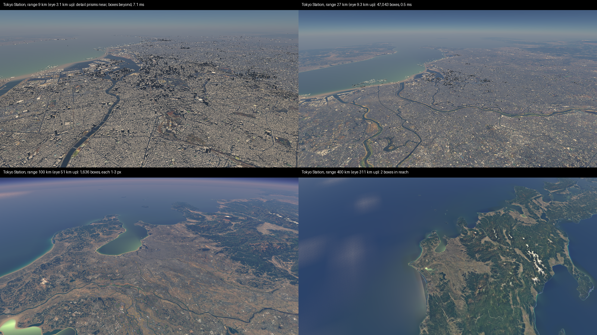

# Building LOD — mass as a conformal vector, size as a level

The owner, 2026-10-09: large buildings should be seen from very far away, from near-space
altitudes, the small ones hidden; check the PGA/CGA literature and the engine's sparse structure
first, and look for a law that may serve the water's sparse voxels later.

Today (PR 74) buildings stream as 0.05° cells within `radius` of the eye, every solid at full
detail. Tokyo at 9 km is 26.6 M vertices; at 27 km it is not drawable. Raising the radius cannot be
the answer: the far field must hold *fewer, larger* things.

## 1. What the literature gives, and what I claim

| piece | source | used for |
|---|---|---|
| Sum of squared plane distances is one 10-number quadric; quadrics **add** | Garland & Heckbert, *Surface Simplification Using Quadric Error Metrics* (1997) | the aggregate's shape is a sum, so it folds |
| Spheres/planes fitted to points linearly, as conformal vectors | Hildenbrand, *Foundations of Geometric Algebra Computing* §5.3; Hildenbrand & Hitzer, point clouds in CGA (2008); Sveier et al. (2017) | the mass of a set is a conformal vector |
| Object level from object SIZE, cell from its centre | Ulrich, loose octrees (1999; *Game Programming Gems*) | where a building lives in the tree |
| Selection by geometric error over distance, replacement refinement | OGC 3D Tiles (HLOD) | when a level is drawn |
| Footprint generalized to an equivalent rectangle | Kwinta & Bac-Bronowicz, *Simplification of 2D shapes with equivalent rectangles* (2022); CityGML LoD1 generalization (Biljecki et al.) | the far shape of one building |
| Geometry sheds to statistics past Nyquist, energy conserved | this engine, `math fold` | what a hidden building leaves behind |

Each piece is published. I have not found them put together as below, but I searched only
briefly, so **I claim the combination as untested for novelty, not as new.**

## 2. The object: a cell's mass is one conformal vector

For a solid of unit density, its moments about an origin are `m = ∫dV`, `s = ∫x dV`,
`S = ∫x xᵀ dV` (1 + 3 + 6 = 10 numbers: the same ten as a Garland–Heckbert quadric). The conformal
embedding is linear in `(1, x, x²)`:

    X(x) = n0 + x + ½ x² n∞

so integrating it over the solid is

    M = ∫ X dV = m n0 + s + ½ tr(S) n∞            (a grade-1 vector of Cl(4,1))

and three facts follow, each pinned in the self-test:

1. **Folding is addition.** A union of solids has `M = Σ Mᵢ`. A parent cell's mass is the sum of its
   children's, exactly. This is the fold law of `math fold` in its linear case: nothing is
   thresholded before it is summed.
2. **Moving a frame is the versor sandwich.** A child stored about its own origin reaches the
   parent's origin by `T M T̃` with the same `cga::Translator` the sun uses, and a change of unit is
   the `cga::Dilator`. The parallel-axis theorem is this sandwich acting on the n∞ part.
3. **The vector is a sphere.** `M = m (X(c) + ½ σ² n∞)`: the centroid `c = s/m`, and the spread
   `σ² = tr(S)/m − |c|²` read back as `σ² = −M²/(M·n∞)²`, an imaginary dual sphere of radius σ.
   So the bounding/attention sphere of any aggregate comes out of the sum with no pass over its
   parts.

The CGA vector holds the isotropic part of `S`. The orientation needs the traceless part, 5 more
numbers, folded by the same parallel-axis law. Both are kept: the vector for the sphere and the
frame changes, the full `S` for the box.

## 3. The far shape: the moment box

From `S` about the centroid, the horizontal 2×2 block gives the principal heading
`θ = ½ atan2(2Cxy, Cxx − Cyy)` and variances `λ₁, λ₂`. The vertical gives `λz`. A uniform box of
half-width `a` has variance `a²/3`, so the box is

    half-extents  aᵢ = k √(3λᵢ),   hz = √(3λz),   k² = A / (4 a₁ a₂)   with A = m / (2 hz)

One law for one building and for a crowd: a single prism returns its own height exactly
(`λz = L²/12`), a rectangle returns itself, and every box conserves **volume, centroid and
heading**. Only the aspect is the moments' choice. A tower stays a tower and a block of row houses
becomes one long low box. 12 triangles replace a footprint of any size.

## 4. Where a building lives: size picks the level

Each solid's size is its box's circumscribed radius `ρ = √(a₁² + a₂² + hz²)`. It lives at level

    k = ⌊log₂(ρ / ρ₀)⌋,   ρ₀ = 4 m

with its cell at that level chosen by its centroid (Ulrich). A level-`k` thing covers
`ρ / (d · pixAng)` pixels at distance `d`, so level `k` is wanted out to

    d_k = ρ₀ 2^k / (τ · pixAng)

which is the globe's own `LeafWants` measure (span over distance times pixel angle), not a new
one. With `pixAng ≈ 1e-3` and `τ = 1 px`: level 0 to 4 km, level 6 (ρ ≥ 256 m) to 256 km,
level 8 (ρ ≥ 1 km) to 1000 km, which is near space. Cells at level `k` are `2^k` times the size of
level 0's, so each level holds about the same number of cells in view. The tree is as deep as the
largest structure, and there is no altitude switch: one inequality per level.

## 5. What a hidden building leaves: geometry sheds to statistics

Below a level's threshold a building's box is not drawn, but its `M` stays summed in its cell.
The cell's residual mass (the sum of what is hidden) is the built-up **volume fraction, mean
height and spread**, the same three numbers a sparse water voxel needs for porosity and blockage.
Drawn, it darkens and roughens the ground instead of vanishing. This is the water's fold law
(geometry → σ², energy kept) applied to buildings, and it is why a city does not pop out as you
climb. It is step 4 below, not the first PR.

## 6. On the sparse structure

**What was planned:** level-`k` cells as the cube lattice's tiles (`face, rung, x, y`), the
lattice every tenant shares (HIERARCHY §0), with each tile's folded `M` beside its boxes.

**What was built (steps 2–3), and why it differs:** the tiles are the building harvest's own
0.05° grid, doubled per level (`lod::TileDeg`: 0.05° for level 2, up to 3.2° for level 8). Every
record is filed by its *detail cell*, the 0.05° cell the streaming draws its full prisms in. A far box
and its prisms therefore always agree on which cell owns the building, and the layer can skip
exactly the boxes whose cell is drawn. On the cube lattice a tile would cut across those cells and
that agreement would need a second index. Moving both to the cube lattice is one change, made
together; it is not done here. The folded `M` per tile waits for step 4, its only reader.

## 7. Order of work

1. **The moment algebra** (`compose/BuildingMoments`): prism moments, fold, frame change, CGA
   vector, moment box, level law. Gate: `--selftest [lod]` pins §2's three facts and §3's limits.
   **Done.**
2. **The pyramid tool** (`--tool building-lod[:lon0,lat0,lon1,lat1]`, `compose/BuildingLod`): every
   cell of the scene's stack composed by the streaming's own `Compose` (the stack laws hold),
   boxed, filed by level and tile, 36 B a box. Latitude band by band (3.2°), so memory holds one
   band. **Done.** Levels 0 and 1 reach no farther than 8 km, inside the detail radius, so they are
   not kept: in Massachusetts level 1 alone was 58% of 4.75 M solids, and the kept levels 2–8 are
   232,677 boxes (8.4 MB). The state takes 7.3 s on 16 threads.
3. **The far layer** (`BuildingLayer`, `VsBox`): level `k`'s tiles are wanted within its reach
   `ρ₀2^k/(τ·pixAng)` and dropped past 1.25× it. `pixAng` is the camera's vertical field over the
   viewport's height. Each box is 36 vertices from `SV_VertexID`, stood on the composed ground at
   its centroid on the prisms' own east/north/up. A tile within reach of a resident detail cell
   draws only the runs of cells that are *not* resident, so by construction no building is drawn twice
   (no instrument counts it yet). **Done.**
   It uses the layer's own distance measure, not the globe walk's leaves: the same span-over-
   distance law, not yet the same caller.
   *Also:* buildings, prisms and boxes alike, are now seen through `AerialPerspective`, the
   ground's own air. Without it far boxes stood at full contrast in haze that faded the land under
   them.
4. **The residual**: the hidden mass as a ground tenant (coverage, height, roughness).

### Measured (Massachusetts pyramid, 1600×900, frozen clock)

| view | eye | far tiles | boxes loaded | buildings GPU |
|---|---|---|---|---|
| downtown Newburyport | 141 m | 100 | 7,275 | 1.15 ms (0.39 ms without the air) |
| Boston, range 30 km | 9.3 km up | 109 | 14,803 | 0.18 ms (0.05 ms without the air) |
| Boston, range 100 km | 51 km up | 16 | 310 | < 0.01 ms |
| Boston, range 300 km | 216 km up | 0 | 0 | 0 |

### Measured (the planet pyramid, Tokyo Station, 1600×900, frozen clock)

The planet: 712.7 M solids, 1.33 M cells, 35 min on 16 threads; 41.4 M boxes kept, 1.5 GB.
Levels 2–8 hold 33.0 M, 7.2 M, 1.05 M, 108 k, 8,276, 428 and 98 boxes.

| range | eye | detail cells | far tiles | boxes loaded | buildings GPU |
|---|---|---|---|---|---|
| 9 km | 3.1 km up | 16 | 162 | 104,446 | 7.1 ms (4.4 ms without the air) |
| 27 km | 9.3 km up | 0 | 145 | 47,043 | 0.51 ms |
| 100 km | 51 km up | 0 | 54 | 1,636 | < 0.01 ms |
| 400 km | 311 km up | 0 | 1 | 2 | 0 |

Before the boxes, Tokyo at 27 km never finished streaming: its full prisms were tens of millions
of vertices. 

At 300 km nothing in Massachusetts covers a pixel: its largest structures are under 512 m, so
level 7 is empty. The air costs 0.77 ms downtown and 2.7 ms over central Tokyo: every overdrawn
prism pixel marches it (likely because the window chain's `discard` keeps the depth test late:
unmeasured). Taken per
vertex instead it cost 1.87 ms downtown, so it stays per pixel. The fix to try next is the
overdraw itself: draw near to far, with an early-depth PSO wherever no window is open.

## 8. Open for the owner

- `ρ₀ = 4 m` and `τ = 1 px` are the two numbers the law needs. They are scene keys
  (`layers.buildings.lodRho0`, `lodPixels`), not constants in code.
- The box replaces a building's shape past its detail radius. An outline that matters at distance
  (a stadium's ring, the Pentagon) would need a second far shape. Level-2 rings simplified by the
  existing Visvalingam–Whyatt importance could serve; I left that out.
